# Auto-Crab 系统架构文档

## 概述

Auto-Crab 是一个基于 **Tauri v2** 构建的桌面 AI 助手应用，采用 Rust 后端 + React/TypeScript 前端的混合架构。核心能力是通过大模型驱动的 Agent 循环，实现截图分析、文件操作、Shell 执行、网页抓取等自动化任务。

---

## 术语表：给 Java 后端开发者的概念映射

如果你熟悉 Java/Spring 生态，以下对照表帮助你快速理解本项目中的技术概念：

### 框架与运行时

| 本项目概念 | Java 世界的等价物 | 通俗解释 |
|-----------|-----------------|---------|
| **Tauri** | Electron 的轻量替代 ≈ Spring Boot + 内嵌浏览器 | 一个桌面应用框架：Rust 写后端逻辑，内嵌 WebView 渲染前端页面。类似于用 Spring Boot 提供 API，前端页面嵌在同一个进程里 |
| **WebView** | 内嵌的浏览器窗口 | 不是独立浏览器，而是应用内嵌的一个"迷你 Chrome"，用来渲染 HTML/CSS/JS 界面 |
| **IPC (Inter-Process Communication)** | HTTP API / RPC 调用 | 前端 JS 和后端 Rust 之间的通信管道。`invoke()` 相当于前端调后端的 REST 接口，`emit()` 相当于后端通过 WebSocket 推送消息给前端 |
| **invoke("command", args)** | `fetch("/api/command", {body: args})` | 前端调用后端函数，等待返回结果。类似于前端发 HTTP POST 请求到 Controller |
| **emit("event", payload)** | WebSocket `send()` / SSE 推送 | 后端主动向前端推送事件。类似于 Spring 的 `SseEmitter` 或 WebSocket 消息推送 |
| **listen("event", callback)** | WebSocket `onMessage` / EventSource 监听 | 前端注册事件监听器，收到后端推送时触发回调 |
| **Tokio** | Netty / 虚拟线程 (Project Loom) | Rust 的异步运行时，类似 Java 的线程池 + 非阻塞 IO。`tokio::spawn` ≈ `CompletableFuture.supplyAsync()` |
| **#[tauri::command]** | `@RestController` + `@PostMapping` | Rust 的宏注解，标记一个函数为可被前端调用的命令。等价于 Spring MVC 的 Controller 方法 |

### 前端概念

| 本项目概念 | Java 世界的等价物 | 通俗解释 |
|-----------|-----------------|---------|
| **React** | Thymeleaf / JSP（但更强大） | 前端 UI 框架，用组件化方式构建页面。每个 `.tsx` 文件 = 一个可复用的 UI 组件 |
| **Zustand Store** | Spring 的 `@Service` 单例 Bean | 前端的全局状态容器。`chatStore` 管理聊天消息 ≈ 后端的 `ChatService` 管理业务状态 |
| **Vite** | Maven / Gradle | 前端的构建工具，负责编译 TypeScript、打包资源。`npm run dev` ≈ `mvn spring-boot:run` |
| **Tailwind CSS** | 内联样式的工具类 | CSS 框架，用预定义的类名（如 `flex`, `rounded-xl`）直接在 HTML 上写样式，不需要单独的 CSS 文件 |

### 后端概念

| 本项目概念 | Java 世界的等价物 | 通俗解释 |
|-----------|-----------------|---------|
| **Rust trait** | Java `interface` | 定义一组方法签名，不同类型可以各自实现。`ModelProvider` trait ≈ `ModelProvider` 接口 |
| **impl Trait for Struct** | `class Xxx implements Interface` | Rust 的接口实现语法 |
| **Arc\<T\>** | 线程安全的共享引用 ≈ `AtomicReference` | 原子引用计数智能指针，允许多线程共享同一个对象 |
| **serde** | Jackson / Gson | 序列化/反序列化库。`#[derive(Serialize, Deserialize)]` ≈ `@JsonProperty` |
| **reqwest** | OkHttp / RestTemplate / WebClient | HTTP 客户端库，用来调用大模型 API |
| **keyring** | Java KeyStore / Vault | 操作系统级别的密钥存储，API Key 存在 Windows 凭据管理器中 |
| **TOML 配置** | application.yml / application.properties | 配置文件格式，类似 YAML 但更简洁 |
| **oneshot channel** | `CompletableFuture<T>` | 一次性的异步通信管道。审批流程中，后端等待用户点击"批准"，前端 invoke 触发 oneshot 信号解除阻塞 |

### 数据流模式对照

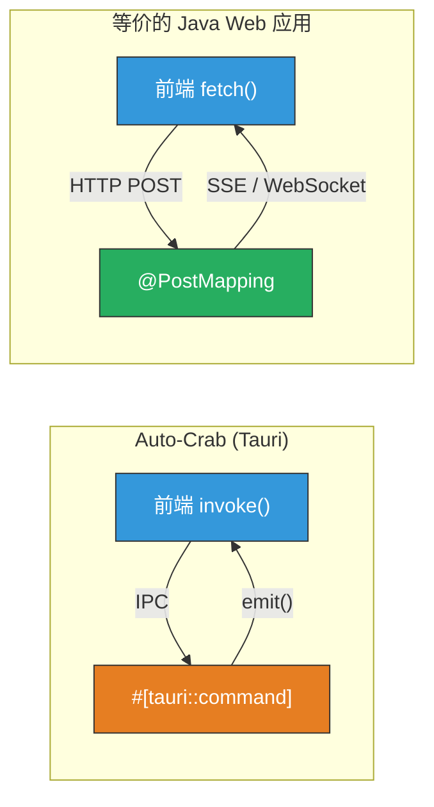

> **一句话总结：** Tauri IPC 本质上就是"前端调后端 API + 后端推送事件给前端"，只不过不走 HTTP 协议，而是走进程内的高效通信管道。对 Java 开发者来说，把 `invoke` 想象成 REST 调用，`emit` 想象成 WebSocket 推送，就完全理解了。

---

## 技术栈一览

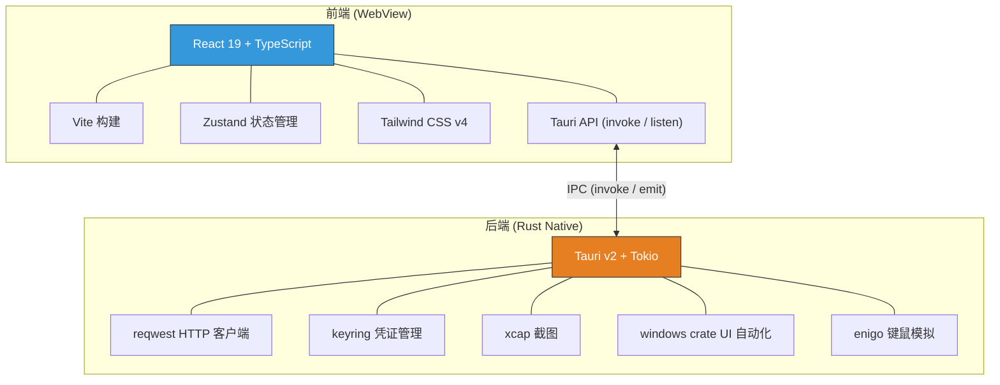

---

## 整体系统架构

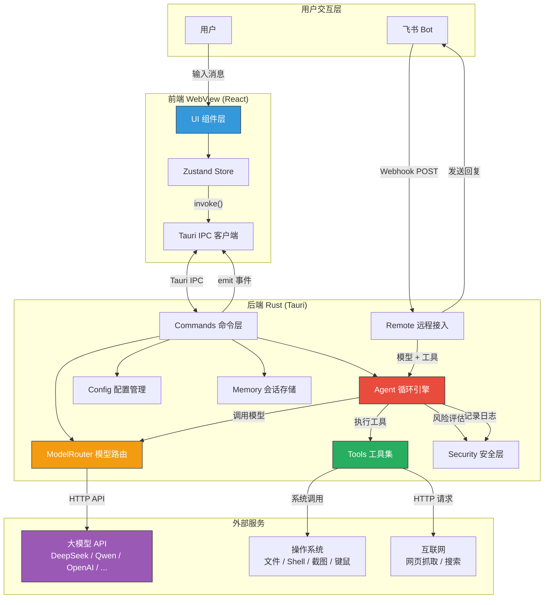

---

## 目录结构

```
auto-crab/
├── src/                          # 前端 (React/TypeScript)
│   ├── main.tsx                  # 入口：挂载 <App />
│   ├── index.css                 # 全局样式 + Tailwind + CSS 变量（主题）
│   ├── App.tsx                   # 根组件：视图路由 + 全局对话框
│   ├── stores/                   # 状态管理 (Zustand)
│   │   ├── appStore.ts           # 视图切换、侧边栏状态
│   │   ├── chatStore.ts          # 会话消息、会话列表、持久化
│   │   └── themeStore.ts         # 主题切换 (light/dark/system)
│   └── components/               # UI 组件
│       ├── Chat/                 # 聊天界面
│       │   ├── ChatView.tsx      # 主聊天视图（消息列表 + 输入框）
│       │   ├── ChatMessage.tsx   # 单条消息渲染（Markdown + 代码高亮）
│       │   └── ModelSelector.tsx # 模型选择下拉框
│       ├── Sidebar/
│       │   └── Sidebar.tsx       # 侧边栏（导航 + 会话列表）
│       ├── Settings/
│       │   └── SettingsView.tsx  # 设置页（模型配置 + API Key 管理）
│       ├── TaskPanel/
│       │   └── TaskPanel.tsx     # 右侧任务面板（Agent 步骤展示）
│       ├── AuditLog/
│       │   └── AuditLogView.tsx  # 审计日志查看
│       ├── ApprovalDialog/
│       │   └── ApprovalDialog.tsx# 高风险操作审批弹窗
│       └── Onboarding/
│           └── OnboardingWizard.tsx # 首次使用引导
│
├── src-tauri/                    # 后端 (Rust/Tauri)
│   ├── src/
│   │   ├── main.rs               # 程序入口
│   │   ├── lib.rs                # Tauri 应用初始化、状态注入、命令注册
│   │   ├── commands.rs           # 所有 Tauri IPC 命令实现
│   │   ├── config/
│   │   │   ├── mod.rs            # 配置文件加载/保存
│   │   │   └── schema.rs         # 配置结构体定义
│   │   ├── models/
│   │   │   ├── mod.rs            # 模块导出
│   │   │   ├── provider.rs       # ModelProvider trait + 通用类型
│   │   │   ├── openai_compat.rs  # OpenAI 兼容 HTTP 适配器
│   │   │   ├── ollama.rs         # Ollama 本地模型适配器
│   │   │   └── router.rs         # 模型路由器（按 slot/task 分发）
│   │   ├── tools/
│   │   │   ├── mod.rs            # 模块导出
│   │   │   ├── registry.rs       # 工具注册表（JSON Schema 定义）
│   │   │   ├── file_ops.rs       # 文件读写工具
│   │   │   ├── shell.rs          # Shell 命令执行
│   │   │   ├── browser.rs        # 浏览器操作
│   │   │   ├── web.rs            # 网页抓取
│   │   │   └── ui_automation.rs  # Windows UI 自动化
│   │   ├── remote/
│   │   │   ├── mod.rs            # 模块导出
│   │   │   ├── webhook_server.rs # HTTP Webhook 服务器 (端口 18790)
│   │   │   ├── feishu.rs         # 飞书 Bot 集成
│   │   │   ├── wechat_work.rs    # 企业微信 Bot（已定义，未完全接入）
│   │   │   ├── protocol.rs       # 远程命令解析 (/status, /task, ...)
│   │   │   └── approval_bridge.rs# 远程审批通知
│   │   ├── security/             # 凭证管理、风险评估、审计日志
│   │   ├── core/                 # Agent 抽象、上下文、调度器
│   │   └── plugins/              # 插件沙箱（预留）
│   ├── defaults/
│   │   └── auto-crab.default.toml# 默认配置模板
│   ├── capabilities/
│   │   └── default.json          # Tauri 权限声明
│   └── tauri.conf.json           # Tauri 应用配置
│
├── docs/                         # 文档
├── package.json                  # 前端依赖
├── vite.config.ts                # Vite 构建配置
└── index.html                    # HTML 入口
```

---

## 前端架构

### 组件树

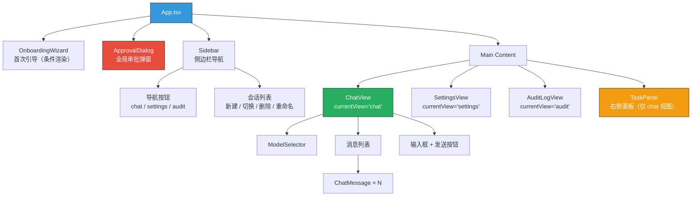

### 状态管理

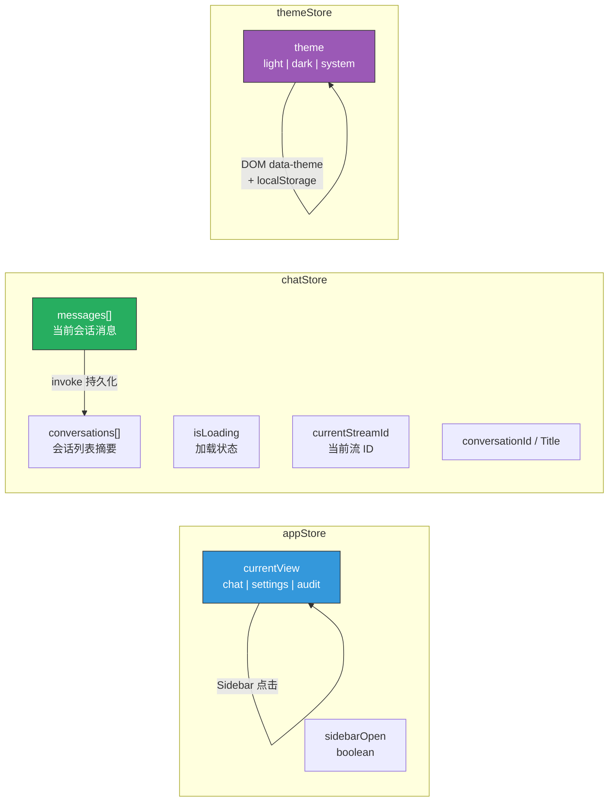

### 视图路由

前端没有使用 React Router，而是通过 `appStore.currentView` 进行简单的视图切换：

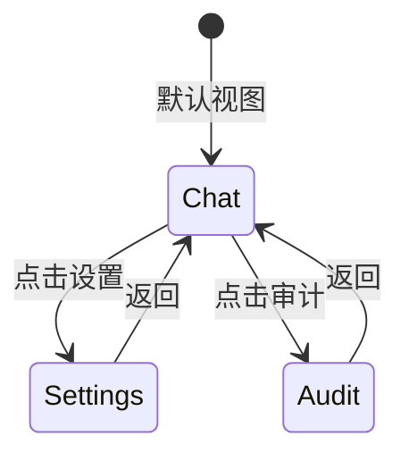

---

## 后端架构

### 模块职责

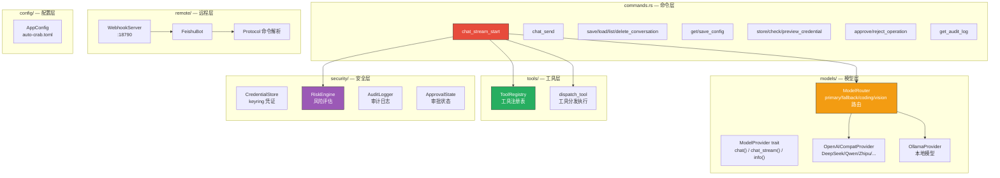

### 模型路由机制

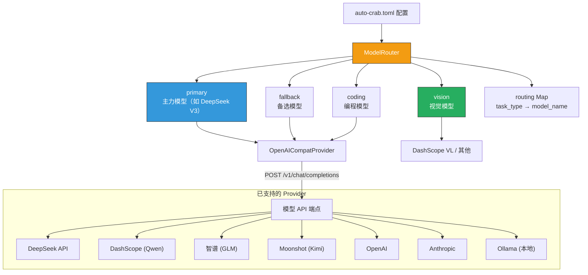

### 工具集

```mermaid
graph TB
    TR["ToolRegistry"]

    subgraph "文件操作"
        T1["read_file"]
        T2["write_file"]
        T3["list_directory"]
        T4["read_pdf"]
    end

    subgraph "系统操作"
        T5["execute_shell"]
        T6["screenshot"]
        T7["mouse_click"]
        T8["keyboard_type"]
        T9["key_press"]
    end

    subgraph "网络操作"
        T10["fetch_webpage"]
        T11["search_web"]
        T12["get_crypto_price"]
    end

    subgraph "UI 自动化"
        T13["get_ui_tree"]
        T14["focus_window"]
        T15["analyze_screen"]
        T16["analyze_and_act"]
    end

    subgraph "应用集成"
        T17["quick_reply_wechat"]
    end

    TR --> T1 & T2 & T3 & T4
    TR --> T5 & T6 & T7 & T8 & T9
    TR --> T10 & T11 & T12
    TR --> T13 & T14 & T15 & T16
    TR --> T17

    style TR fill:#27AE60,stroke:#333,color:#fff
```

---

## 核心信息流

### 信息流一：桌面端对话（主流程）

这是用户在桌面端与 AI 对话的完整链路，包含工具调用的 Agent 循环。

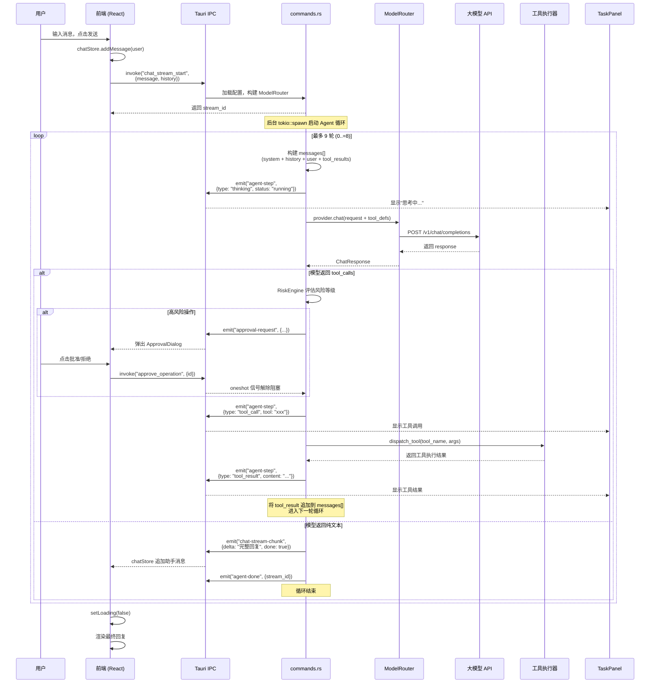

### 信息流二：飞书远程对话

用户通过飞书 Bot 发消息，触发后端同样的 Agent 循环。

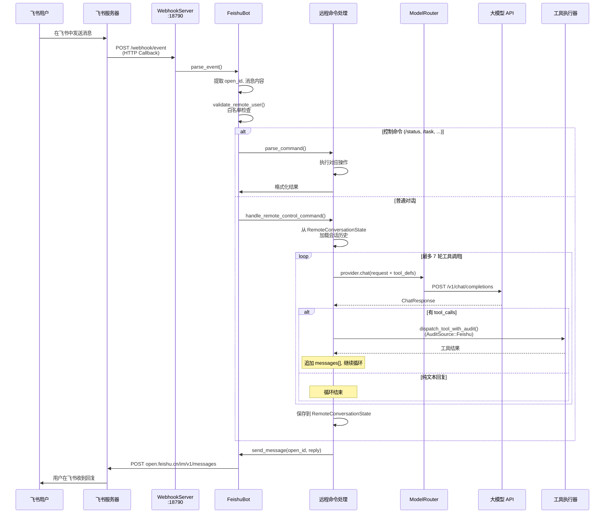

### 信息流三：会话持久化

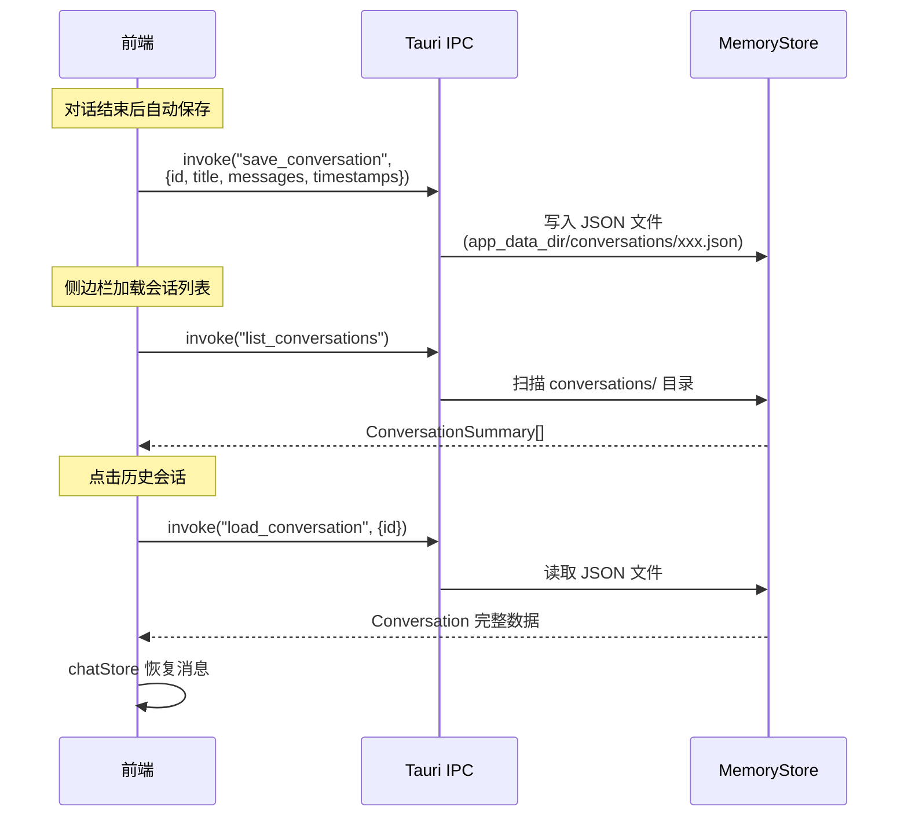

### 信息流四：配置与凭证管理

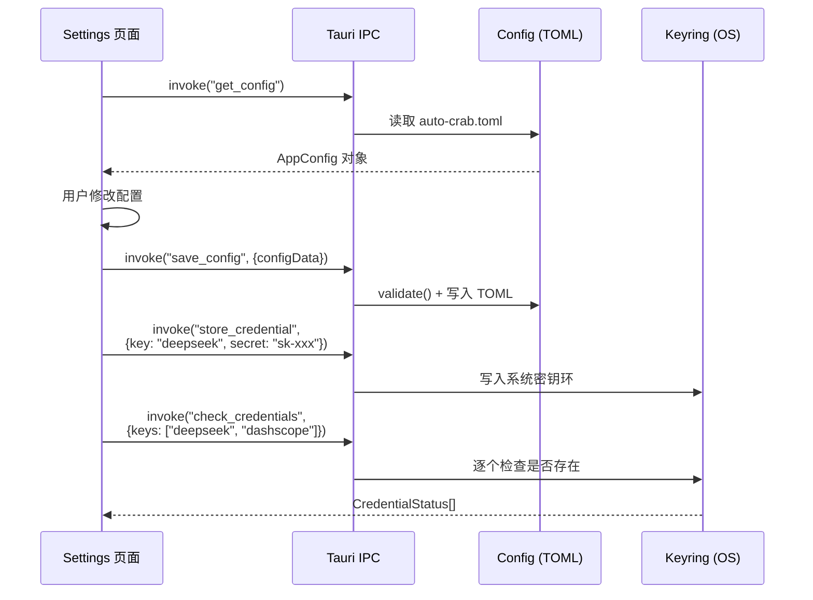

---

## 前后端 IPC 通信全景

### 前端 → 后端（invoke 命令）

| 命令 | 调用位置 | 参数 | 返回值 | 说明 |
|------|---------|------|--------|------|
| `chat_stream_start` | ChatView | `{message, history}` | `stream_id` | 启动 Agent 流式对话 |
| `chat_send` | (未在前端使用) | `{message, model_override}` | `{reply, model, usage}` | 一次性问答（无工具） |
| `save_conversation` | chatStore | `{conversation}` | `()` | 保存会话 |
| `load_conversation` | chatStore | `{id}` | `Conversation` | 加载会话 |
| `list_conversations` | chatStore | 无 | `ConversationSummary[]` | 会话列表 |
| `delete_conversation` | chatStore | `{id}` | `()` | 删除会话 |
| `get_config` | SettingsView | 无 | `AppConfig` | 读取配置 |
| `save_config` | SettingsView | `{configData}` | `()` | 保存配置 |
| `store_credential` | SettingsView, Onboarding | `{key, secret}` | `()` | 存储 API Key |
| `check_credentials` | SettingsView | `{keys[]}` | `CredentialStatus[]` | 检查 Key 是否已配置 |
| `get_credential_preview` | SettingsView | `{key}` | `String` (掩码) | 预览已存储的 Key |
| `approve_operation` | ApprovalDialog | `{id}` | `()` | 批准高风险操作 |
| `reject_operation` | ApprovalDialog | `{id, reason}` | `()` | 拒绝高风险操作 |
| `get_audit_log` | AuditLogView | `{limit?}` | `AuditEntry[]` | 查询审计日志 |

### 后端 → 前端（emit 事件）

| 事件名 | Payload | 监听位置 | 说明 |
|--------|---------|---------|------|
| `chat-stream-chunk` | `{stream_id, delta, done}` | ChatView | 流式文本片段 |
| `chat-stream-error` | `{stream_id, error}` | ChatView | 流式错误通知 |
| `agent-step` | `{id, stream_id, type, tool, content, status, timestamp}` | TaskPanel | Agent 步骤更新 |
| `agent-done` | `{stream_id}` | TaskPanel | Agent 循环完成 |
| `approval-request` | `PendingApproval` | ApprovalDialog | 请求用户审批 |

---

## 安全机制

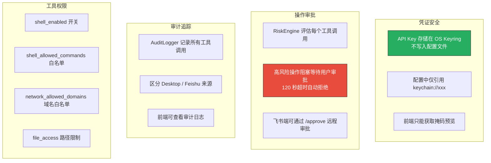

---

## 配置体系

配置文件 `auto-crab.toml` 的结构：

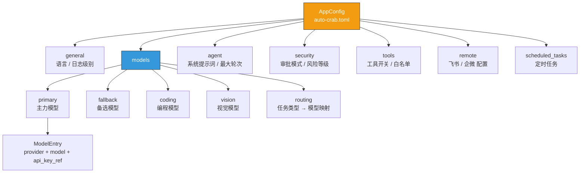

---

## AI Agent 理论模型映射

参照业界公认的 AI Agent 四大组成模块（规划、记忆、工具使用、行动），分析 Auto-Crab 目前的实现程度。

### Agent 理论架构 vs 当前实现

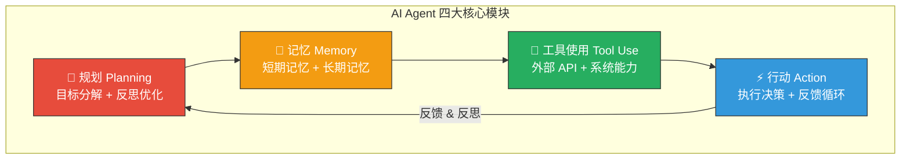

### 各模块实现对照

#### 1. 规划 (Planning) — 当前：✅ 已实现 Planner + Reflect

| 能力 | 业界标准 | Auto-Crab 现状 | 差距 |
|------|---------|---------------|------|
| 目标分解 | 将复杂任务拆分为子步骤（如 LangGraph 的 StateGraph） | ✅ `core/planner.rs` — LLM 自动分解复杂任务为 3-8 个子步骤 | 无 |
| 反思优化 | 对执行结果进行自我评估，调整后续策略 | ✅ `Planner::reflect()` — 每步执行后评估 continue/retry/skip/abort/revise | 无 |
| 多步骤编排 | 定义工作流图（DAG），控制执行顺序和条件分支 | ⚠️ 顺序执行 + 反思调整，非 DAG。通过 `should_plan()` 自动检测复杂任务 | 中 |

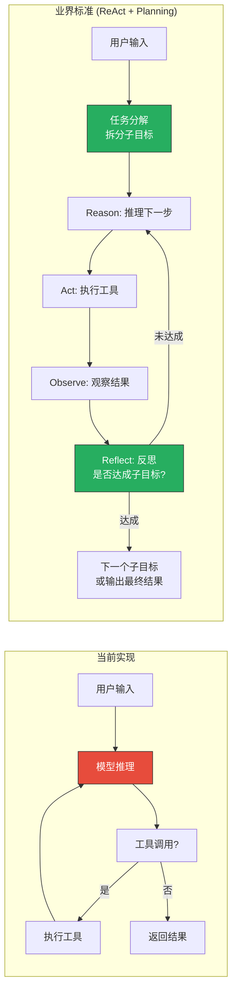

#### 2. 记忆 (Memory) — 当前：✅ 短期 + 长期 RAG

| 能力 | 业界标准 | Auto-Crab 现状 | 差距 |
|------|---------|---------------|------|
| 短期记忆 | 当前对话的上下文窗口 | ✅ 已实现。`history` 参数传入对话历史 | 无 |
| 会话持久化 | 保存和恢复历史会话 | ✅ 已实现。`MemoryStore` 将会话存为 JSON | 无 |
| 长期记忆 | 向量数据库 + 语义检索（RAG） | ✅ 已实现。DashScope Embedding + 本地向量检索 + 余弦相似度 | 无 |
| 工作记忆 | 跨工具调用的中间结果缓存 | ⚠️ Planner 的 step_results 提供跨步骤上下文 | 中 |
| 用户画像 | 学习用户偏好和习惯 | ⚠️ 长期记忆间接学习（但无显式画像模型） | 中 |

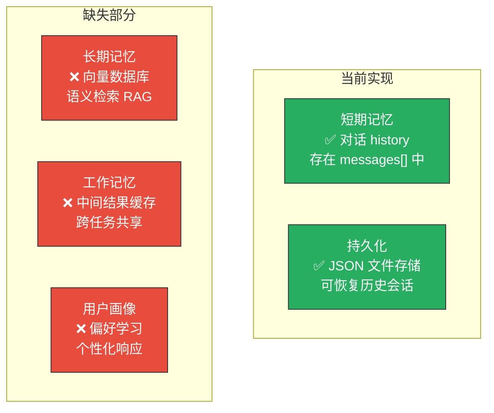

#### 3. 工具使用 (Tool Use) — 当前：✅ 较完善

| 能力 | 业界标准 | Auto-Crab 现状 | 差距 |
|------|---------|---------------|------|
| 工具注册 | JSON Schema 定义工具参数 | ✅ `ToolRegistry` 注册 17 个工具 | 无 |
| 工具分发 | 根据模型返回的 tool_calls 执行 | ✅ `dispatch_tool` 分支匹配执行 | 无 |
| 权限控制 | 工具级别的白名单/黑名单 | ✅ shell 命令白名单、域名白名单 | 无 |
| 风险评估 | 高危操作需要人工审批 | ✅ `RiskEngine` + `ApprovalState` | 无 |
| 工具组合 | 多工具协同（如截图→分析→操作） | ⚠️ 通过魔法字符串前缀实现，非正式的组合机制 | 中 |
| 动态工具 | 运行时注册/发现新工具（MCP 协议） | ❌ 工具在编译时固定 | 中 |

#### 4. 行动 (Action) — 当前：✅ 已实现核心循环

| 能力 | 业界标准 | Auto-Crab 现状 | 差距 |
|------|---------|---------------|------|
| ReAct 循环 | Reason → Act → Observe 循环 | ✅ `chat_stream_start` 中的 Agent 循环 | 无 |
| 多通道行动 | 桌面操作 + 远程 Bot | ✅ 桌面 + 飞书双通道 | 无 |
| 审批控制 | 人在回路（HITL） | ✅ 120 秒超时审批机制 | 无 |
| 错误恢复 | 工具失败后重试或换策略 | ❌ 工具失败后结果直接返回模型，无重试 | 中 |
| 并行执行 | 独立工具并行调用 | ❌ 工具串行执行 | 中 |

### 综合成熟度

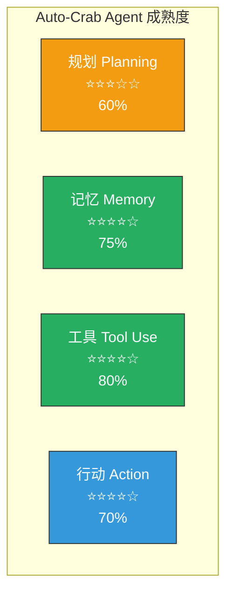

---

## Java 迁移方案

如果未来要将 Auto-Crab 从 Rust/Tauri 迁移到 Java 技术栈，以下是推荐的迁移路径。

### 技术选型映射

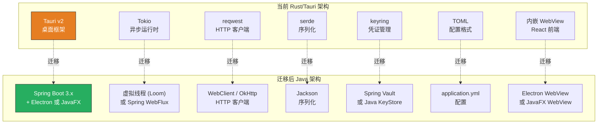

### 推荐的 Java Agent 框架

| 框架 | 特点 | 适合场景 |
|------|------|---------|
| **Spring AI** (1.0 GA) | Spring 生态深度集成、ChatClient API、Advisors 模式、MCP 协议支持 | 已有 Spring 项目、需要企业级可观测性 |
| **LangChain4j** (1.0 GA) | 框架无关、强类型、15+ Provider 支持、三层抽象 | 灵活性优先、非 Spring 环境 |
| **Spring AI + LangChain4j** | 混合使用 | 取两者之长 |

### 模块迁移对照

```mermaid
graph LR
    subgraph "Rust 模块 → Java 模块"
        direction TB
        A1["commands.rs<br/>#[tauri::command]"] -->|"→"| A2["@RestController<br/>+ @PostMapping"]
        B1["models/provider.rs<br/>trait ModelProvider"] -->|"→"| B2["interface ModelProvider<br/>Spring AI ChatModel"]
        C1["models/router.rs<br/>ModelRouter"] -->|"→"| C2["@Service ModelRouter<br/>或 Spring AI ChatClient"]
        D1["tools/registry.rs<br/>ToolRegistry"] -->|"→"| D2["@Tool 注解方法<br/>Spring AI FunctionCallback"]
        E1["config/schema.rs<br/>AppConfig"] -->|"→"| E2["@ConfigurationProperties<br/>application.yml"]
        F1["security/<br/>keyring + RiskEngine"] -->|"→"| F2["Spring Security<br/>+ Spring Vault"]
        G1["remote/feishu.rs<br/>FeishuBot"] -->|"→"| G2["@Component FeishuBot<br/>+ WebClient"]
    end
```

### 推荐的 Java 项目结构

```
auto-crab-java/
├── src/main/java/com/autocrab/
│   ├── AutoCrabApplication.java
│   ├── controller/              # ← commands.rs
│   │   ├── ChatController.java  #   chat_stream_start → SSE endpoint
│   │   ├── ConfigController.java
│   │   └── ConversationController.java
│   ├── agent/                   # ← core/
│   │   ├── AgentLoop.java       #   ReAct 循环引擎
│   │   ├── Planner.java         #   任务分解（新增）
│   │   └── Reflector.java       #   反思评估（新增）
│   ├── model/                   # ← models/
│   │   ├── ModelProvider.java   #   interface → Spring AI ChatModel
│   │   ├── ModelRouter.java     #   路由 primary/fallback/vision
│   │   └── OpenAICompatAdapter.java
│   ├── tool/                    # ← tools/
│   │   ├── ToolRegistry.java    #   @Tool 注解 + FunctionCallback
│   │   ├── FileTools.java
│   │   ├── ShellTools.java
│   │   └── WebTools.java
│   ├── memory/                  # ← core/memory + 新增
│   │   ├── ConversationStore.java #  会话持久化
│   │   ├── VectorMemory.java    #   向量数据库（新增）
│   │   └── WorkingMemory.java   #   工作记忆（新增）
│   ├── remote/                  # ← remote/
│   │   ├── FeishuBot.java
│   │   └── WebhookController.java
│   ├── security/                # ← security/
│   │   ├── CredentialService.java
│   │   ├── RiskEngine.java
│   │   └── AuditLogger.java
│   └── config/
│       └── AppConfig.java       # @ConfigurationProperties
├── src/main/resources/
│   ├── application.yml
│   └── tools-schema.json        # 工具 JSON Schema
└── pom.xml                      # Spring Boot + Spring AI
```

### 桌面端方案选择

迁移到 Java 后，桌面应用框架有三种选择：

| 方案 | 前端复用 | 包体积 | 系统集成 | 推荐度 |
|------|---------|--------|---------|--------|
| **Electron + Spring Boot** | ✅ React 代码完全复用 | 大 (~150MB) | 一般 | ⭐⭐⭐⭐ |
| **JavaFX + WebView** | ✅ React 代码可嵌入 | 中 (~80MB) | 好 | ⭐⭐⭐ |
| **纯 Web 应用** (放弃桌面) | ✅ 完全复用 | 无 | 差（无法截屏/键鼠） | ⭐⭐ |

> **建议：** 如果需要保留截屏、键鼠控制等桌面能力，用 **Electron + Spring Boot 本地服务** 方案。前端 React 代码几乎无需修改，Spring Boot 启动一个本地 HTTP 服务替代 Tauri IPC，Electron 内嵌 WebView 连接 `localhost`。

### 迁移风险点

| 风险 | 说明 | 应对策略 |
|------|------|---------|
| Windows UI 自动化 | Rust `windows` crate 直接调用 Win32 API，Java 需要 JNA/JNI | 使用 JNA 封装或改用 Accessibility Bridge |
| 截图性能 | Rust `xcap` 零开销，Java `Robot.createScreenCapture` 较慢 | 可接受，或用 JNI 调用原生库 |
| 键鼠模拟 | Rust `enigo` 精准控制，Java `Robot` 功能有限 | 用 JNA 调用 SendInput Win32 API |
| 包体积 | Tauri ~10MB，Electron ~150MB | 用户可接受的代价 |
| 冷启动速度 | Rust 毫秒级启动，JVM 需要数秒 | GraalVM Native Image 或 CRaC |

---

## 架构问题分析与优化建议

### 架构现状评估

```mermaid
graph TB
    subgraph "🟡 可优化"
        G5["工具串行执行<br/>独立工具不能并行"]
        G6["硬编码工具集<br/>运行时无法动态注册新工具 (MCP)"]
    end

    subgraph "🟢 已完成"
        G1["P3 任务规划器<br/>Planner 自动分解 + 反思"]
        G2["P2 长期记忆 RAG<br/>DashScope Embedding + 向量检索"]
        G3["P1 流式输出<br/>逐 token 推送"]
        G4["P0 Agent 解耦<br/>AgentEngine 统一引擎"]
        G7["P4 魔法字符串<br/>engine.rs 统一处理"]
        G8["统一 Agent 实现<br/>桌面+飞书+企微+定时共用引擎"]
        G9["安全审批机制 HITL"]
        G10["多通道接入<br/>飞书 + 企业微信"]
        G11["模型可插拔"]
        G12["工具权限控制"]
        G13["搜索国内可用<br/>Bing + DuckDuckGo fallback"]
    end
```

### 已完成的优化

#### P0：Agent 核心循环解耦 (已完成 2026-03-26)

**改动前：** Agent 循环写在 `commands.rs`（346行）和 `lib.rs`（147行）两处，逻辑重复、维护困难。

**改动后：** 统一为 `core/engine.rs` 的 `AgentEngine`，通过 `EventSink` trait 抽象事件输出。

```mermaid
graph TB
    subgraph "AgentEngine (core/engine.rs)"
        ENGINE["AgentEngine::run()"]
        ENGINE --> MODEL["provider.chat()"]
        ENGINE --> DISPATCH["dispatch_tool()"]
        ENGINE --> RESOLVE["resolve_tool_action()"]
        ENGINE --> RISK["RiskEngine 评估"]
        ENGINE --> AUDIT["AuditLogger 记录"]
    end

    subgraph "EventSink 实现"
        TAURI_SINK["TauriEventSink<br/>AppHandle.emit()<br/>桌面端"]
        STRING_SINK["StringCollectorSink<br/>tracing + 返回 String<br/>飞书/定时任务"]
    end

    subgraph "调用方（瘦客户端）"
        CMD["commands.rs<br/>chat_stream_start<br/>~30 行"]
        REMOTE["lib.rs<br/>run_remote_chat<br/>~15 行"]
        SCHED["lib.rs<br/>TaskScheduler<br/>复用 run_remote_chat"]
    end

    CMD -->|"TauriEventSink"| ENGINE
    REMOTE -->|"StringCollectorSink"| ENGINE
    SCHED --> REMOTE

    ENGINE --> TAURI_SINK
    ENGINE --> STRING_SINK
```

**核心组件：**

| 组件 | 文件 | 职责 |
|------|------|------|
| `AgentEngine` | `core/engine.rs` | 模型调用 + 工具执行 + 魔法字符串解析 的唯一实现 |
| `AgentConfig` | `core/engine.rs` | max_rounds / tools_enabled / audit / memory 配置 |
| `EventSink` trait | `core/engine.rs` | 事件输出抽象（thinking/tool_call/result/answer/error/approval） |
| `TauriEventSink` | `core/engine.rs` | 桌面端：`AppHandle.emit()` 推送前端事件 + `DESKTOP_APPROVALS` 审批 |
| `StringCollectorSink` | `core/engine.rs` | 远程端：`tracing::info` 日志，auto-approve，返回纯文本 |

**瘦身效果：**

| 函数 | 改动前 | 改动后 |
|------|--------|--------|
| `chat_stream_start` | 346 行 | 30 行 |
| `run_remote_chat` | 147 行 | 15 行 |
| 魔法字符串解析 | 两处各 30 行 | engine.rs 一处 25 行 |

#### P4：魔法字符串统一处理 (已完成 2026-03-26)

`dispatch_tool` 仍返回 `String`（含魔法前缀），但 `AgentEngine::resolve_tool_action()` 统一处理三种前缀（`__ANALYZE_SCREEN__`、`__ANALYZE_AND_ACT__`、`__WECHAT_REPLY__`），调用方不再需要逐一 `starts_with` 解析。

#### P1：真正的流式输出 (已完成 2026-03-27)

**改动前：** Agent 最终回答用 `provider.chat()`（非流式），生成完毕后一次性推送全文。

**改动后：** 最终回答改用 `provider.chat_stream()`，逐 token 推送。

- `EventSink` 新增 `on_stream_delta(delta)` 和 `on_stream_end()`
- `AgentEngine::stream_final_answer()` 方法处理流式输出
- DSML 检测时自动清理消息历史（移除空 content 的 tool_call 消息）后重试
- 流式失败时自动降级到非流式

#### P2：长期记忆 RAG (已完成 2026-03-28)

**新增模块：** `core/long_memory.rs`

工作流程：
1. 用户发消息 → DashScope Embedding API 向量化 → 在本地 vectors.json 中检索余弦相似度 > 0.3 的记忆
2. 将 Top 3 相关记忆注入 System Prompt 后面
3. 正常执行 Agent 循环
4. 最终回答后，自动将「用户问题 + AI 回答」向量化存入

配置开关：`[agent] long_term_memory = true/false`

技术选型：DashScope `text-embedding-v2`（1536 维），本地 JSON 文件存储，余弦相似度检索。成本约 ¥0.0002/次。

#### P3：任务规划器 (已完成 2026-03-28)

**改动前：** 复杂任务靠模型在 prompt 中自由规划，不可控。简单的 `for round in 0..=8` 循环无法有效处理多步骤协作任务。

**改动后：** 引入 `core/planner.rs`，通过 LLM 显式分解复杂任务 + 每步反思评估。

- `Planner::plan()` — 让模型将目标拆分为 3-8 个原子步骤
- `Planner::reflect()` — 每步执行后评估结果，决定 Continue / Retry / Skip / Abort / Revise
- `should_plan()` — 启发式检测：包含"分析+并且"、"搜索+总结"等组合关键词的任务自动启用规划
- `AgentEngine::run_with_plan()` — 规划模式执行路径，每步独立运行 Agent 循环（max_rounds=4）

**工作流程：**

```mermaid
graph TB
    INPUT["用户输入"] --> CHECK{"should_plan()?"}
    CHECK -->|"简单任务"| DIRECT["run_direct()<br/>直接 Agent 循环"]
    CHECK -->|"复杂任务"| PLAN["Planner::plan()<br/>分解为子步骤"]
    
    PLAN --> STEP["执行当前步骤<br/>run_simple()"]
    STEP --> REFLECT["Planner::reflect()<br/>评估结果"]
    REFLECT -->|"Continue"| NEXT{"还有步骤?"}
    REFLECT -->|"Retry"| STEP
    REFLECT -->|"Skip"| NEXT
    REFLECT -->|"Abort"| SUMMARY
    REFLECT -->|"Revise"| REVISE["修改下一步"] --> NEXT
    NEXT -->|"是"| STEP
    NEXT -->|"否"| SUMMARY["流式输出总结报告"]
    
    style CHECK fill:#F39C12,stroke:#333,color:#fff
    style REFLECT fill:#9B59B6,stroke:#333,color:#fff
    style PLAN fill:#27AE60,stroke:#333,color:#fff
```

#### 企业微信接入 (已完成 2026-03-28)

- `webhook_server.rs` 支持 `/webhook/wechat_work` 路由，与飞书共用 `:18790` 端口
- `wechat_work.rs` 实现 AES-256-CBC 消息解密 + SHA1 签名验证
- 消息处理复用 `handle_remote_control_command()`，所有飞书指令（/status, /reset, /monitor 等）在企业微信中同样可用

#### search_web 国内可用性 (已完成 2026-03-28)

- 搜索引擎优先级：Bing (`cn.bing.com`，国内直连) → DuckDuckGo (fallback)
- Bing 搜索解析 `b_algo` 结构，提取标题/摘要/URL
- 失败自动降级，保证搜索功能在墙内可用

### 待实施的优化建议

#### P1：实现真正的流式输出

**问题：** 当前 Agent 循环使用 `provider.chat()`（非流式），模型回复完成后一次性 emit 给前端。用户必须等待整个回复生成完毕才能看到内容。

**建议：** 在最终一轮（无 tool_calls 时）使用 `provider.chat_stream()`，逐 token 推送给前端。

```mermaid
sequenceDiagram
    participant FE as 前端
    participant AGENT as Agent
    participant LLM as 大模型

    Note over AGENT: 当前：整块返回
    AGENT->>LLM: chat() 非流式
    LLM-->>AGENT: 完整回复（等待数秒）
    AGENT->>FE: emit("chunk", {delta: 整段文字, done: true})

    Note over AGENT: 优化后：逐 token 流式
    AGENT->>LLM: chat_stream() 流式
    loop 每个 token
        LLM-->>AGENT: chunk
        AGENT->>FE: emit("chunk", {delta: "一", done: false})
    end
    AGENT->>FE: emit("chunk", {delta: "", done: true})
```

#### P2：引入长期记忆 (RAG)

**问题：** 用户每次新建对话都从零开始，模型不知道用户之前做过什么、偏好什么。

**建议：** 引入向量数据库，将历史对话和工具结果做 Embedding 存储，新对话时自动检索相关上下文。

```mermaid
graph TB
    subgraph "RAG 记忆系统"
        INPUT["用户输入"] --> EMBED["Embedding<br/>文本向量化"]
        EMBED --> SEARCH["向量检索<br/>找到相关历史"]
        SEARCH --> CONTEXT["注入到 System Prompt<br/>相关历史 + 用户偏好"]
        CONTEXT --> LLM["模型推理<br/>（带历史上下文）"]

        SAVE["对话结束"] --> EMB2["Embedding"] --> STORE["向量数据库<br/>SQLite-VSS / Qdrant"]
    end

    style SEARCH fill:#F39C12,stroke:#333,color:#fff
    style STORE fill:#3498DB,stroke:#333,color:#fff
```

> 本地轻量方案推荐 SQLite + sqlite-vss 扩展，无需额外部署向量数据库。

#### P3：添加任务规划模块

**问题：** 复杂任务（如"帮我分析这个交易网站上的 BTC 行情并做出投资建议"）需要多步骤协同——打开网站、截图、分析 K 线、读取指标、综合判断。当前靠模型在 prompt 中自由规划，不可控。

**建议：** 引入显式的任务分解器（Planner），将大任务拆分为子步骤，每步执行后进行反思。

```mermaid
graph TB
    INPUT["用户: 分析 BTC 行情<br/>并给出投资建议"]
    
    INPUT --> PLAN["Planner 任务分解"]
    PLAN --> S1["Step 1: 打开交易网站"]
    PLAN --> S2["Step 2: 截图 K 线图"]
    PLAN --> S3["Step 3: 视觉模型分析形态"]
    PLAN --> S4["Step 4: 获取实时价格"]
    PLAN --> S5["Step 5: 综合判断输出建议"]

    S1 --> E1["execute + reflect"]
    E1 --> S2
    S2 --> E2["execute + reflect"]
    E2 --> S3
    S3 --> E3["execute + reflect"]
    E3 --> S4
    S4 --> E4["execute + reflect"]
    E4 --> S5
    S5 --> OUT["最终投资建议"]

    style PLAN fill:#9B59B6,stroke:#333,color:#fff
    style E1 fill:#27AE60,stroke:#333,color:#fff
    style E2 fill:#27AE60,stroke:#333,color:#fff
    style E3 fill:#27AE60,stroke:#333,color:#fff
    style E4 fill:#27AE60,stroke:#333,color:#fff
```

#### P4：消除魔法字符串，统一工具组合

**问题：** `dispatch_tool` 返回值中用 `__ANALYZE_SCREEN__`、`__ANALYZE_AND_ACT__`、`__WECHAT_REPLY__` 等魔法字符串前缀来触发特殊后处理逻辑，这属于隐式的工具组合，难以维护和扩展。

**建议：** 引入正式的工具组合（Tool Composition）机制，用结构化的方式表达"截图→分析→操作"这类复合流程。

#### P5：统一双 Agent 实现

**问题：** `commands.rs` 中的 Agent 循环和 `core::agent::Agent` 是两套独立实现，功能不同步。

**建议：** 统一为一个 `AgentEngine`，`commands.rs` 和 `remote/` 都使用同一个引擎，通过回调接口（EventEmitter）区分桌面推送和飞书回复。

#### P6：支持 MCP 协议（动态工具）

**问题：** 工具集在编译时固定，无法运行时扩展。

**建议：** 实现 [Model Context Protocol (MCP)](https://modelcontextprotocol.io/) 客户端，允许用户在配置中声明 MCP 服务器，运行时动态发现和调用外部工具。这是 2025-2026 年 Agent 生态的趋势标准。

### 优化路线图

```mermaid
gantt
    title Auto-Crab 架构优化路线图
    dateFormat YYYY-MM
    section P0 基础重构
        解耦 Agent 核心循环          :p0a, 2026-04, 2w
        统一双 Agent 实现            :p0b, after p0a, 1w
    section P1 用户体验
        流式输出 (逐 token)          :p1a, after p0b, 1w
        消除魔法字符串               :p1b, after p1a, 1w
    section P2 记忆系统
        向量数据库集成               :p2a, after p1b, 2w
        RAG 检索增强                :p2b, after p2a, 1w
    section P3 规划能力
        任务分解 Planner            :p3a, after p2b, 2w
        反思 Reflector              :p3b, after p3a, 1w
    section P4 生态集成
        MCP 协议支持                :p4a, after p3b, 2w
        多模态消息格式               :p4b, after p4a, 1w
```

---

## 当前架构的注意事项

### 已实现但未完全打通的部分

| 功能 | 状态 | 说明 |
|------|------|------|
| 前端 ModelSelector | ⚠️ UI 存在但未接入后端 | 选择的模型不传入 `chat_stream_start`，始终使用 primary |
| `chat_send` 命令 | ⚠️ 后端实现但前端未使用 | 一次性问答（无工具），可用于轻量场景 |
| `search_web` 工具 | ✅ 已实现 | Bing 优先（国内可用）+ DuckDuckGo fallback |
| 企业微信 Bot | ✅ 已接入 | webhook_server 支持 `/webhook/wechat_work` 路由，AES 解密，收发消息 |
| Agent 统一引擎 | ✅ 已完成 | `core::engine::AgentEngine` 统一桌面/远程/定时三条路径 |
| 流式输出 | ✅ 已完成 | 最终回答逐 token 推送，DSML 自动重试 |
| 长期记忆 RAG | ✅ 已完成 | DashScope Embedding + 本地向量检索，可配置开关 |
| `core::agent::Agent` | 📦 历史遗留 | 保留但不使用，可作为参考 |
| 任务规划器 | ✅ 已完成 | `core::planner::Planner` — 复杂任务分解 + 反思，自动检测启用 |
| 视觉模型 | ✅ 可用 | `vision` slot + DashScope VL 调用 + 压缩 + 重试 |
| 流式传输 | ✅ 逐 token 流式 | `AgentEngine::stream_final_answer()` 用 `chat_stream()` 逐 token 推送 |
| 定时任务调度 | ✅ 已完成 | `TaskScheduler` 接入主循环，本地时间 cron 匹配，飞书推送 |

### 架构优势

- **Agent 引擎统一** — `AgentEngine` 是唯一的 Agent 循环实现，桌面/飞书/企业微信/定时任务四条路径共用
- **任务规划能力** — `Planner` 自动检测复杂任务并分解为子步骤，每步反思评估后决策
- **事件输出抽象** — `EventSink` trait 解耦了 Agent 逻辑和通道实现，新增通道只需实现 trait
- **安全分层清晰** — 凭证/风险/审计/审批各自独立，审批通过 `EventSink::request_approval()` 统一
- **多通道接入** — 桌面 + 飞书 + 企业微信 + 定时任务复用同一套引擎/模型/工具链路
- **模型可插拔** — Provider trait 统一抽象，新增模型只需实现接口
- **工具可扩展** — Registry 注册制，新增工具只需添加注册项 + dispatch 分支
- **长期记忆 RAG** — DashScope Embedding + 本地向量检索，跨会话知识沉淀
- **可单元测试** — `AgentEngine::run()` 可传入 `StringCollectorSink` 在无 UI 环境下测试
