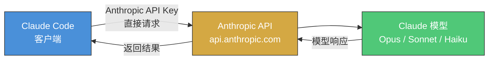
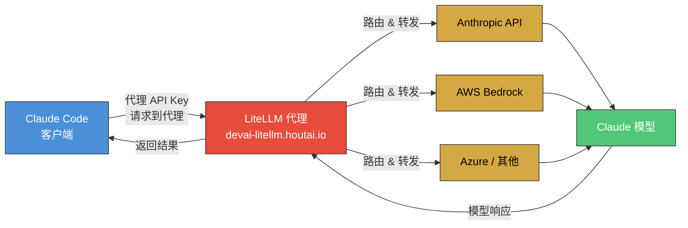
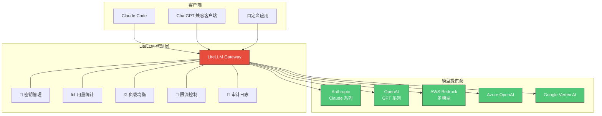
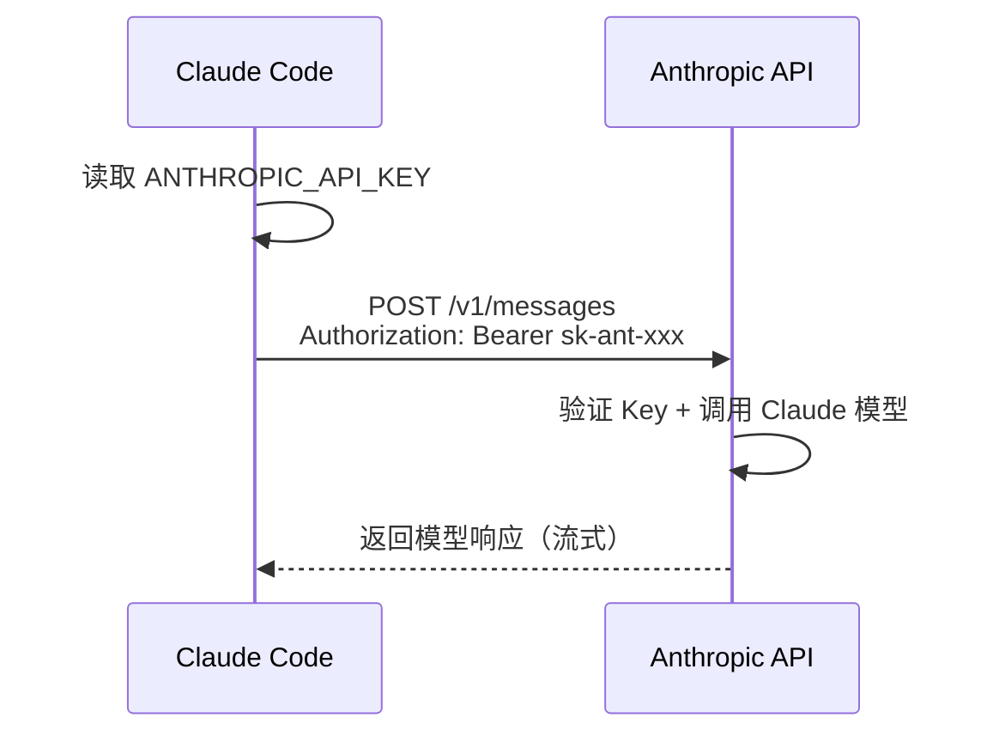
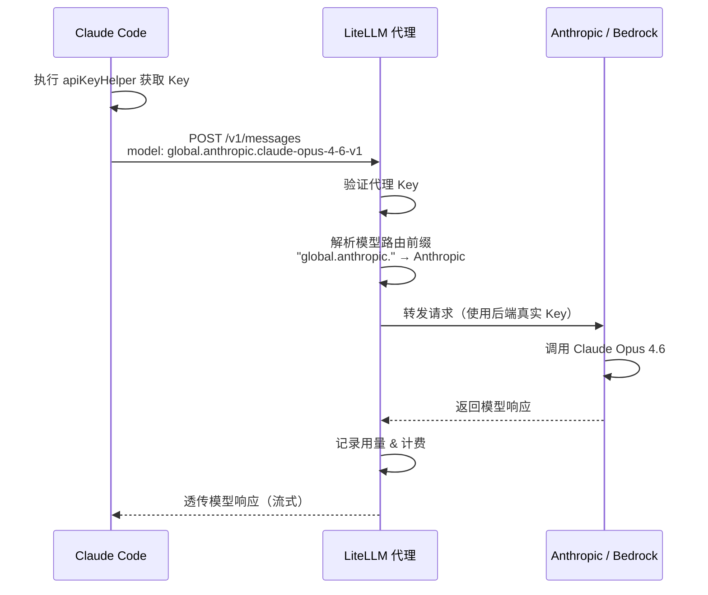
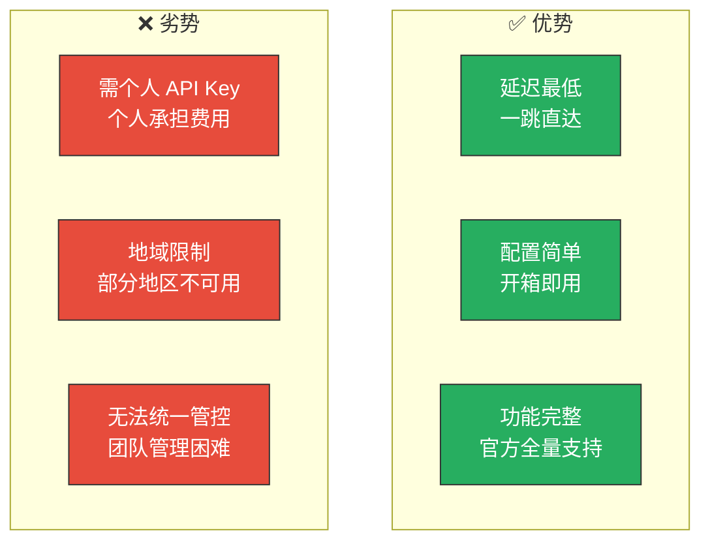
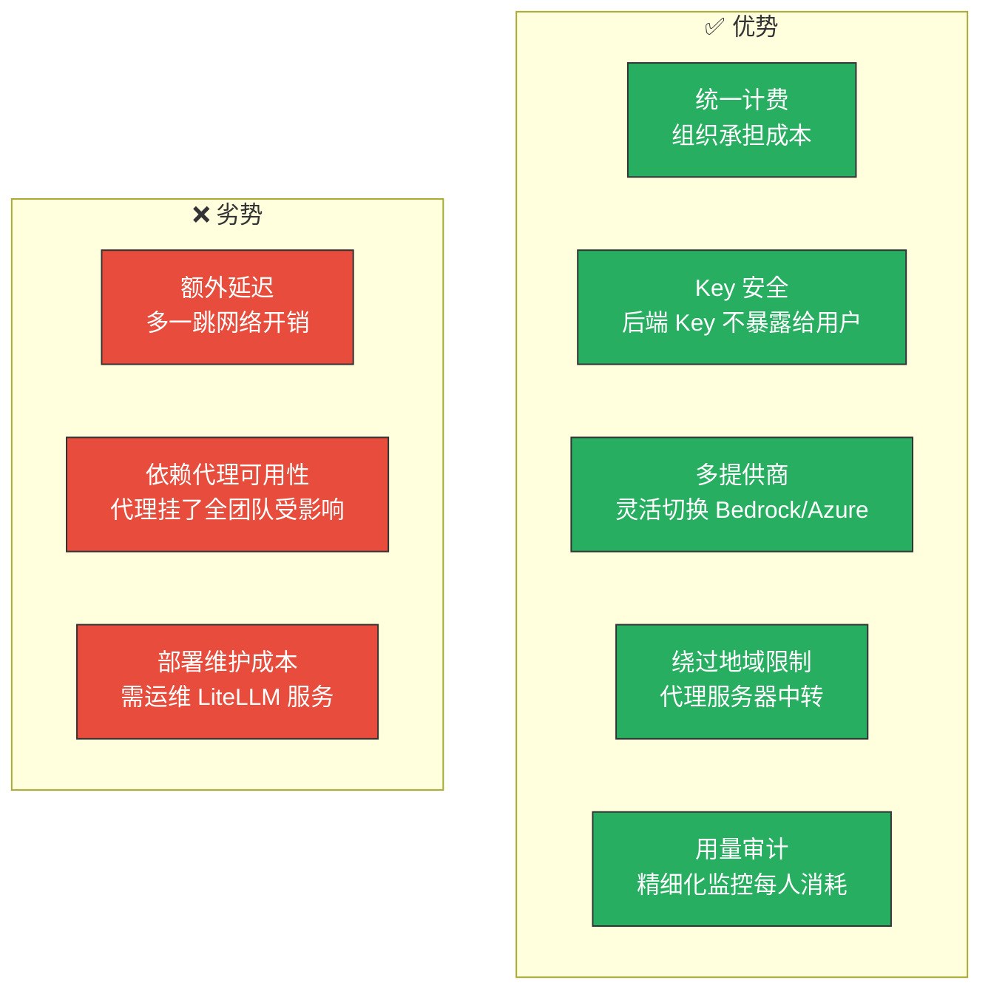
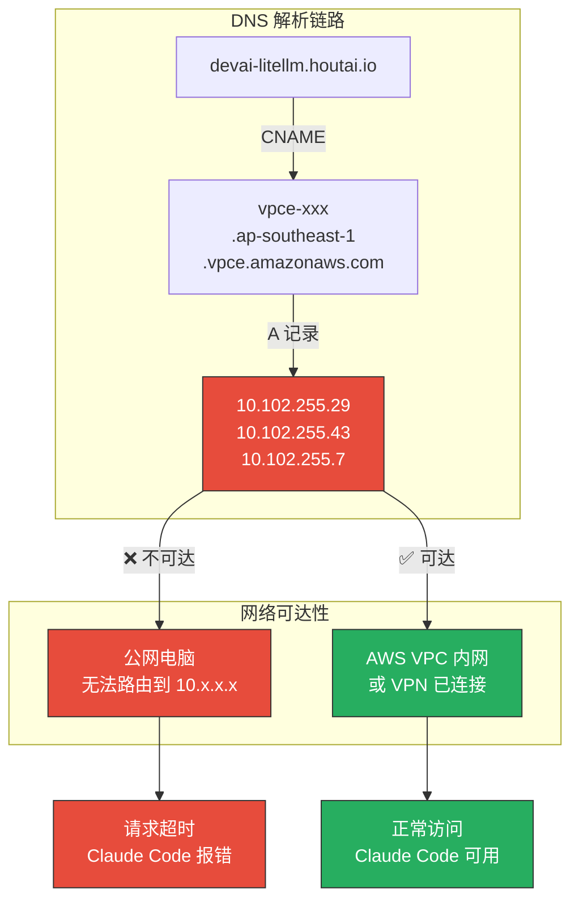
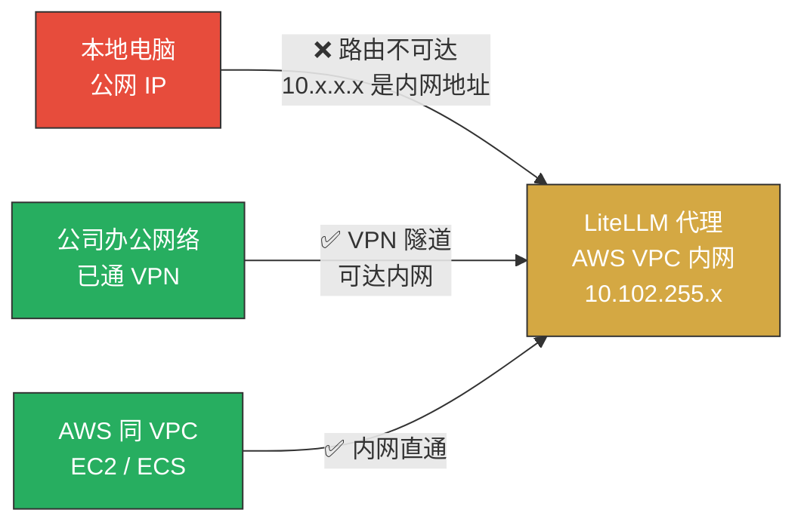

# Claude Code 与 LiteLLM 代理：原理及区别

## 概述

Claude Code 支持两种 API 调用方式：**直连官方 API** 和 **通过 LiteLLM 代理转发**。两者最终调用的都是 Anthropic 的 Claude 模型，区别在于请求的路径和管理方式不同。

---

## 架构对比

### 原生 Claude Code（直连模式）



### 通过 LiteLLM 代理



---

## LiteLLM 是什么

[LiteLLM](https://github.com/BerriAI/litellm) 是一个开源的 **大模型 API 代理网关**，核心功能是将 100+ 种大模型 API（Anthropic、OpenAI、Azure、AWS Bedrock、Google Vertex 等）统一为 **OpenAI 兼容格式**。

它本身 **不是大模型**，只是一个请求转发和管理的中间层。



---

## 请求流程对比

### 直连模式



### 代理模式



---

## 关键配置项解读

以当前 `~/.claude/settings.json` 配置为例：

```json
{
    "apiKeyHelper": "echo sk-xxxxx",
    "env": {
        "ANTHROPIC_MODEL": "global.anthropic.claude-opus-4-6-v1",
        "ANTHROPIC_BASE_URL": "https://devai-litellm.houtai.io/",
        "CLAUDE_CODE_SUBAGENT_MODEL": "global.anthropic.claude-opus-4-6-v1",
        "DISABLE_TELEMETRY": "1"
    }
}
```

| 配置项 | 作用 |
|--------|------|
| `apiKeyHelper` | 动态获取 API Key 的命令，代替静态写死 Key |
| `ANTHROPIC_BASE_URL` | 替换默认的 `api.anthropic.com`，指向 LiteLLM 代理 |
| `ANTHROPIC_MODEL` | 模型标识，带 `global.anthropic.` 前缀用于 LiteLLM 路由 |
| `CLAUDE_CODE_SUBAGENT_MODEL` | 子代理使用的模型 |
| `DISABLE_TELEMETRY` | 禁止 Claude Code 向 Anthropic 上报遥测数据 |

### 模型名前缀含义

```
global.anthropic.claude-opus-4-6-v1
│       │          └── 模型名称（Claude Opus 4.6）
│       └── 提供商标识（Anthropic）
└── LiteLLM 路由策略（全局路由）
```

---

## 详细对比

| 维度 | 原生直连 | LiteLLM 代理 |
|------|---------|-------------|
| **API 端点** | `api.anthropic.com` | 自定义代理地址 |
| **认证方式** | Anthropic 官方 API Key 或账号登录 | 代理分配的 Key（`apiKeyHelper`） |
| **调用的模型** | Claude 原版 | Claude 原版（代理只转发） |
| **模型效果** | ✅ 无损 | ✅ 无损 |
| **计费方** | Anthropic 直接计费 | 组织/团队统一计费 |
| **网络延迟** | 一跳直达 | 多一跳（通常 < 50ms） |
| **Key 管理** | 个人自行管理 | 组织统一分发、轮换 |
| **用量监控** | Anthropic Console | LiteLLM Dashboard + 自定义告警 |
| **多模型切换** | 需改配置 | 改模型前缀即可路由 |
| **地域限制** | 受 Anthropic 区域策略影响 | 代理服务器中转可绕过 |
| **适用场景** | 个人开发者 | 企业/团队协作 |

---

## 优劣势分析

### 直连模式



### LiteLLM 代理模式



---

## 故障排查实录：代理超时问题

### 现象

在本地电脑运行 Claude Code，发送任何消息后持续报错：

```
Request timed out.
Retrying in 26 seconds… (attempt 7/10) · API_TIMEOUT_MS=600000ms, try increasing it
```

即使将超时设到 10 分钟（600000ms），依然无法获得响应。

### 诊断过程

#### 1. DNS 解析检查

```bash
# 解析域名
Resolve-DnsName devai-litellm.houtai.io
```

结果：

| 记录类型 | 值 |
|---------|-----|
| CNAME | `vpce-xxx.ap-southeast-1.vpce.amazonaws.com` |
| A | `10.102.255.29` |
| A | `10.102.255.43` |
| A | `10.102.255.7` |

> **关键发现：** 域名解析到了 `10.x.x.x` 的内网地址，且 CNAME 指向 AWS VPC Endpoint（`vpce-` 前缀）。

#### 2. TCP 端口连通性

```bash
Test-NetConnection -ComputerName "devai-litellm.houtai.io" -Port 443
```

| 检测项 | 结果 |
|--------|------|
| TCP 443 | ✅ 连通（TCP 握手成功） |
| Ping | ❌ 不通 |

> TCP 能通是因为 DNS 解析到了内网 IP，本地网络栈能完成 TCP 握手，但实际 HTTPS 请求无法到达真正的服务。

#### 3. HTTPS 请求测试

```bash
# 直连测试
Invoke-WebRequest -Uri "https://devai-litellm.houtai.io/health" -TimeoutSec 10
# → 超时

# 通过本地代理测试
Invoke-WebRequest -Uri "https://devai-litellm.houtai.io/health" -Proxy "http://127.0.0.1:7890"
# → 超时
```

> 无论直连还是走本地代理，HTTPS 请求均超时，确认网络层面完全不可达。

### 根因分析



**根本原因：** LiteLLM 代理部署在 AWS VPC 内网，通过 VPC Endpoint 暴露服务。域名解析到的 `10.x.x.x` 是 RFC 1918 私有地址，只有处于同一 VPC 或通过 VPN 接入该内网的机器才能访问。本地公网电脑无法路由到这些地址，导致所有请求超时。



### 解决方案

#### 方案 1：连接公司 VPN（推荐）

如果组织提供了 VPN 接入，连上后本地电脑即可路由到 AWS VPC 内网地址，代理恢复可用。

#### 方案 2：切换为直连 Anthropic 官方 API

修改 `~/.claude/settings.json`，去掉代理配置，改用官方 API：

```json
{
    "env": {
        "ANTHROPIC_MODEL": "claude-opus-4-6-20250918",
        "ANTHROPIC_BASE_URL": ""
    }
}
```

然后通过 `claude login` 登录 Anthropic 官方账号，或配置个人 API Key。

> **注意：** 直连模式需要自行承担 API 费用，且可能受到地域限制（参考 [Cursor 区域代理指南](./cursor-region-proxy-guide.md)）。

---

## 常见问题

### Q: 通过代理调用，模型会变笨吗？

**不会。** LiteLLM 只做请求转发，不会修改 prompt 或模型输出。最终调用的模型实例和直连完全相同。

### Q: 代理会看到我的对话内容吗？

**理论上可以。** 请求经过代理服务器，代理管理员有能力记录请求内容。在企业场景下这通常是合规要求（审计日志），但要确保代理服务器由可信方运营。

### Q: 如何切换回直连模式？

修改 `~/.claude/settings.json`，移除代理相关配置：

```json
{
    "env": {
        "ANTHROPIC_BASE_URL": "",
        "ANTHROPIC_MODEL": "claude-opus-4-6-20250918"
    }
}
```

然后使用 Anthropic 官方 API Key 或通过 `claude login` 登录官方账号。

### Q: 模型名为什么有 `global.anthropic.` 前缀？

这是 LiteLLM 的路由规则。LiteLLM 根据前缀决定将请求发往哪个后端提供商。直连模式下不需要此前缀，直接使用 `claude-opus-4-6-20250918` 即可。

---

## 参考资料

- [LiteLLM 官方文档](https://docs.litellm.ai/)
- [Claude Code 官方文档](https://docs.anthropic.com/en/docs/claude-code)
- [Anthropic API 参考](https://docs.anthropic.com/en/api)
