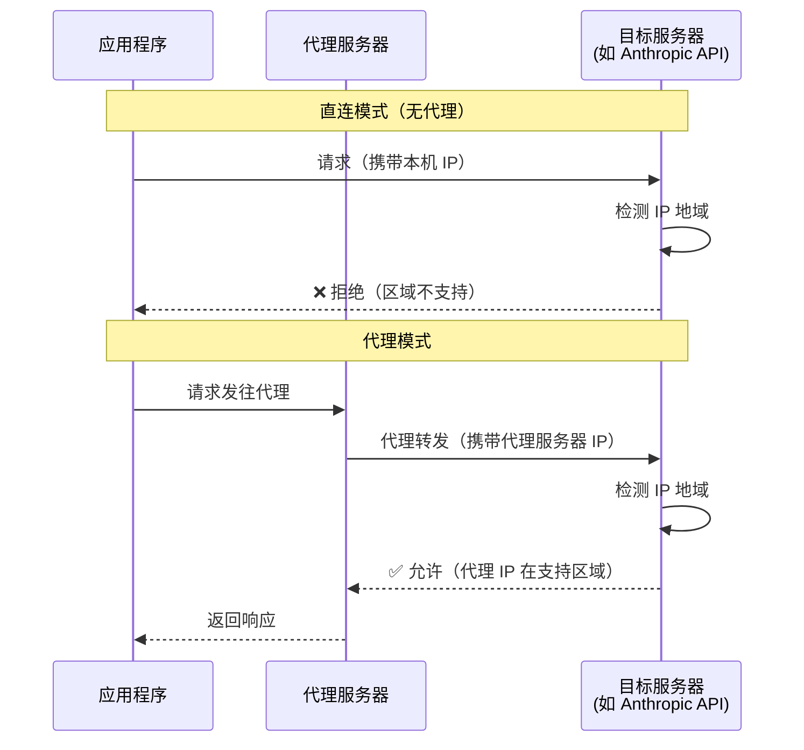
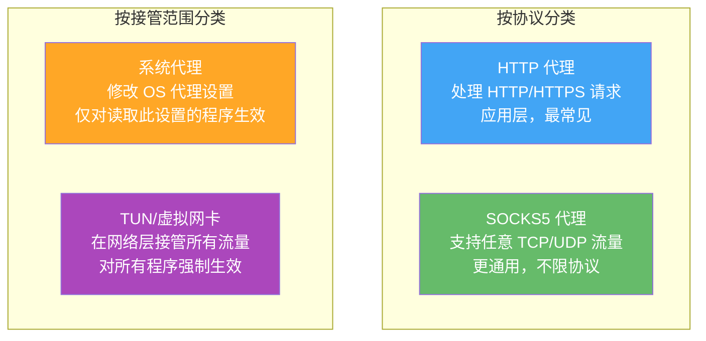
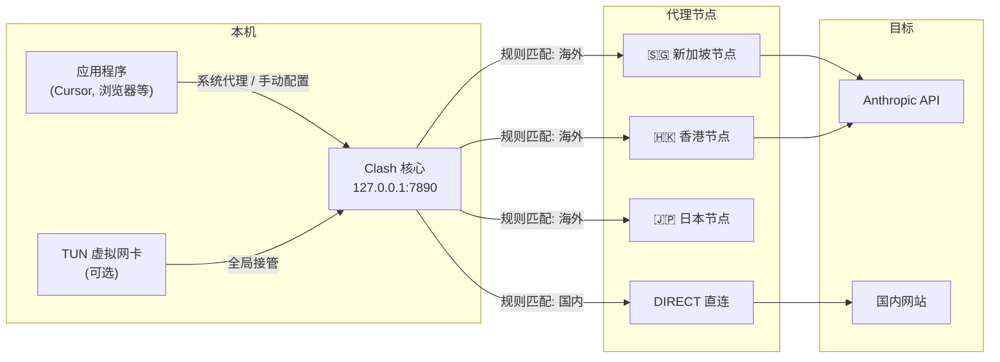
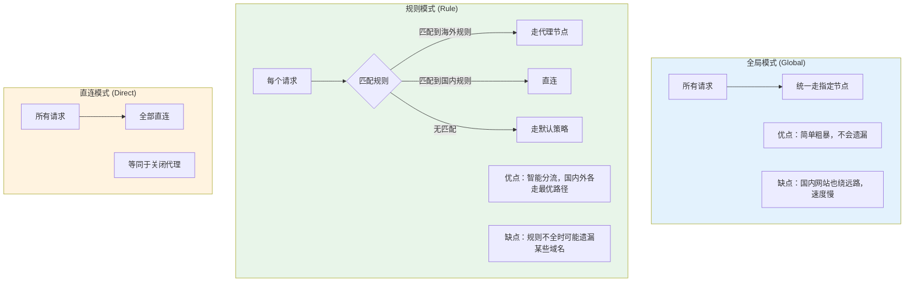
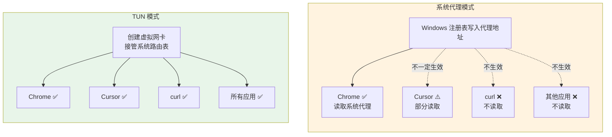
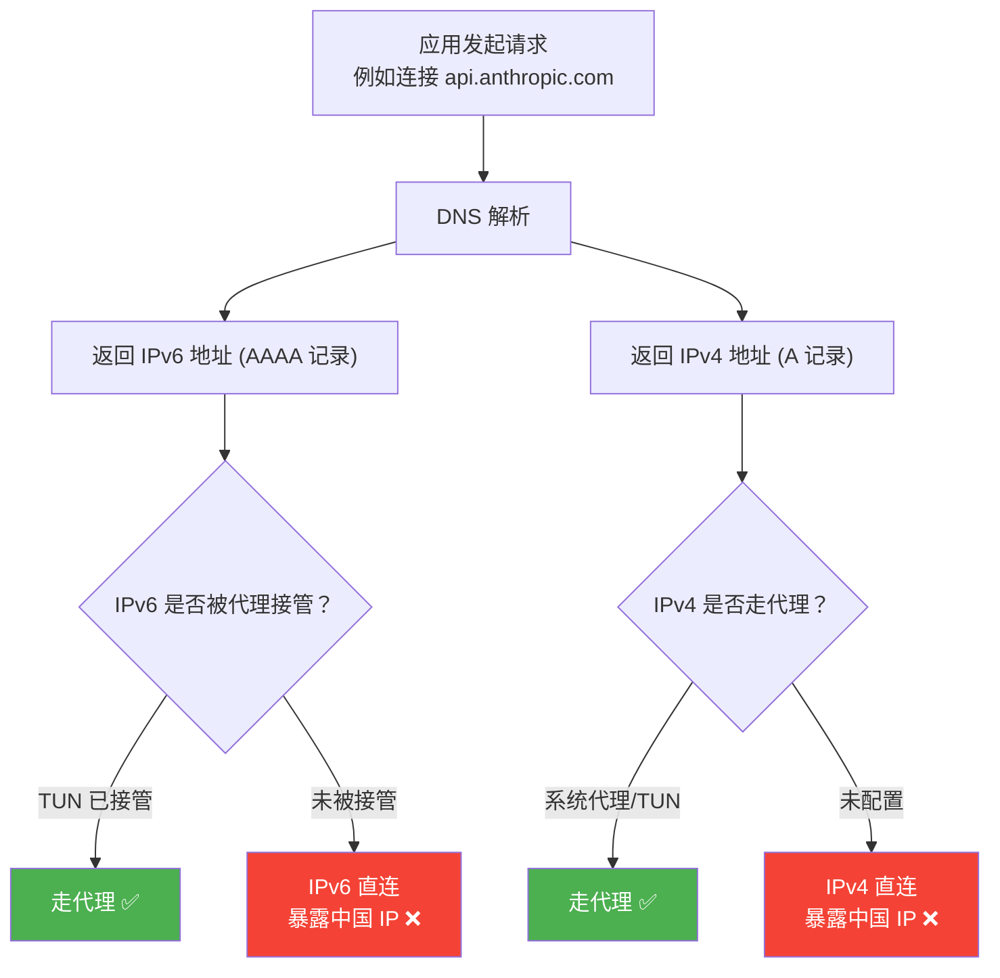
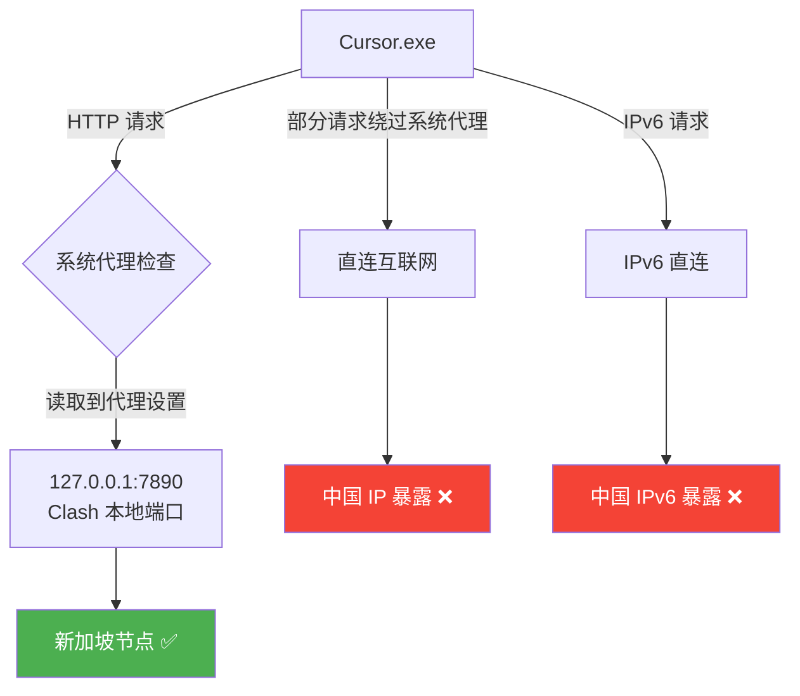
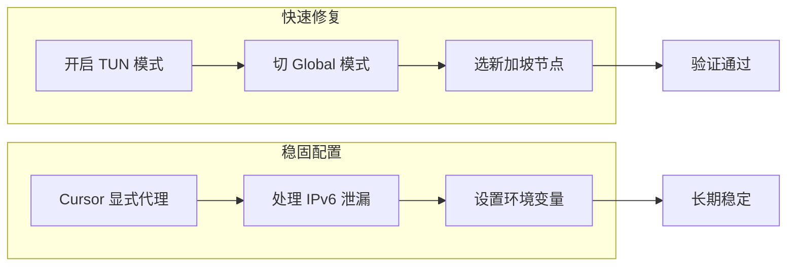
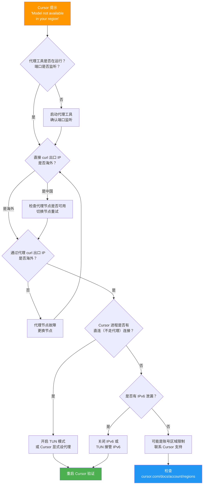

# Cursor "Model not available in your region" 排查与解决指南

## 问题现象

在 Cursor IDE 中调用特定模型（如 Claude Opus 4.6）时，提示：

> ⚡ Model not available
> This model provider does not serve your region.

即使已经开启了代理工具（如 Clash for Windows）并选择了海外节点，问题仍然存在。

---

## 网络代理基础原理

### 什么是代理

代理（Proxy）是客户端与目标服务器之间的中间人。客户端不直接连接目标服务器，而是先把请求发给代理服务器，由代理服务器转发到目标，再把响应返回给客户端。



目标服务器看到的是**代理服务器的 IP**，而不是你本机的 IP，因此可以绕过地域限制。

### 代理的类型



| 类型 | 工作层级 | 接管范围 | 典型场景 |
|------|----------|----------|----------|
| HTTP 代理 | 应用层 (L7) | 仅 HTTP/HTTPS | 浏览器、支持代理设置的应用 |
| SOCKS5 代理 | 会话层 (L5) | TCP/UDP | 需要代理非 HTTP 流量时 |
| 系统代理 | 操作系统设置 | 遵循此设置的程序 | 日常浏览，简单场景 |
| TUN 模式 | 网络层 (L3) | **所有程序的所有流量** | 需要全局代理、防止泄漏 |

### 系统代理的局限性

Windows 的"系统代理"本质上只是在注册表写了一个配置项：

```
HKCU\Software\Microsoft\Windows\CurrentVersion\Internet Settings
  ProxyEnable = 1
  ProxyServer = 127.0.0.1:7890
```

**并非所有程序都会读取这个配置。** 这是核心痛点：

- 浏览器（Chrome/Edge）：会读取 → 走代理 ✅
- Electron 应用（Cursor/VS Code）：部分读取，部分场景会直连 ⚠️
- 命令行工具（curl、git）：不读取系统代理，需要 `HTTP_PROXY` 环境变量 ❌
- 游戏、原生应用：通常不读取 ❌

这就是为什么"系统代理已开启"不等于"所有流量都走代理"。

---

## Clash for Windows 的工作原理

### Clash 是什么

Clash 是一个**规则驱动的多协议代理客户端**。它在本机启动一个代理服务（默认 `127.0.0.1:7890`），接收应用的网络请求，根据规则决定每个请求走哪个出口节点（或直连）。

### 架构总览



### Clash 的三种代理模式



> **关键**：Rule 模式下，如果 Cursor 或 Anthropic 的域名**不在规则列表中**，请求会走"默认策略"。如果默认是 DIRECT，请求就直连暴露了中国 IP。

### 系统代理 vs TUN 模式

这是理解本次问题的关键区别：



**TUN 模式的工作方式**：

1. Clash 创建一个虚拟网卡（TUN 设备）
2. 修改系统路由表，让所有流量都经过这个虚拟网卡
3. 虚拟网卡把流量交给 Clash 核心处理
4. Clash 按规则决定走代理还是直连

因为是在**网络层（L3）** 拦截，不依赖应用程序是否"主动"读取代理设置，所以可以覆盖所有程序。

### 服务模式 (Service Mode)

TUN 模式需要修改系统路由表和创建虚拟网卡，这些操作需要**管理员权限**。Clash 的"服务模式"会安装一个系统服务，以管理员身份运行 Clash 核心，从而获得操作网络栈的权限。

启用顺序：**先开 Service Mode → 再开 TUN Mode**。

### IPv6 与代理泄漏

现代网络环境中，很多 ISP 同时提供 IPv4 和 IPv6 地址。当应用程序发起连接时：



本次问题中，排查发现 `Cursor.exe` 存在一条 IPv6 直连：

```
TCP [2408:8340:e42:...]:58979 → [2606:4700::6812:127d]:443 ESTABLISHED
```

这条连接完全绕过了代理，Cloudflare/Anthropic 服务端看到的是中国联通的 IPv6 地址。

---

## 根因分析

### 核心原因：代理未全量接管 Cursor 流量

Cursor 是基于 Electron 的桌面应用，它的网络请求存在多条路径。当代理配置不完整时，部分请求会**绕过代理直连**，导致服务端仍检测到中国 IP。

本次排查发现的具体问题：

| 检查项 | 结果 | 影响 |
|--------|------|------|
| 系统代理 (HTTP) | ✅ 已设置 `127.0.0.1:7890` | 部分请求走代理 |
| WinHTTP 代理 | ❌ 未设置（直连） | 部分系统级请求不走代理 |
| 环境变量代理 | ❌ 未设置 | CLI/子进程不走代理 |
| IPv6 | ❌ 未被代理接管 | IPv6 请求直连暴露中国 IP |
| TUN 模式 | ❌ 未开启 | 无法全局接管所有流量 |

### 流量泄漏示意



> 只要有**一条请求**从中国 IP 发出，服务端就可能判定为"不支持的区域"。

---

## 解决方案

### 方案总览



### 第一步：Clash 配置调整

#### 1. 开启服务模式 + TUN

TUN 模式会在系统层面创建虚拟网卡，接管**所有**网络流量（包括不走系统代理的请求）。

- 打开 Clash for Windows → **设置**
- 先开启 **Service Mode**（服务模式，需管理员权限）
- 再开启 **TUN Mode**（Stack 建议选 `Mixed` 或 `gVisor`）

#### 2. 临时切换 Global 模式

在 **代理** 页面顶部切换为 **全局（Global）**，选择一个延迟低的新加坡节点。

> 验证通过后可以切回 **规则（Rule）** 模式，但要确保规则中 Cursor/Anthropic 相关域名走代理。

#### 3. 确保 IPv6 被接管

在 Clash 主页：
- 若 TUN 已开启，IPv6 流量通常会被接管
- 若仍有 IPv6 泄漏，可临时在 Clash 主页关闭 **IPv6** 开关

### 第二步：Cursor 显式代理配置

Cursor 不一定完全遵循系统代理。在 Cursor 设置中显式指定：

1. 打开 Cursor → `Ctrl + ,` → 搜索 `proxy`
2. 设置以下两项：

| 设置项 | 值 |
|--------|-----|
| `http.proxy` | `http://127.0.0.1:7890` |
| `http.proxySupport` | `override` |

或直接编辑 `settings.json`：

```json
{
    "http.proxy": "http://127.0.0.1:7890",
    "http.proxySupport": "override"
}
```

> 修改后**必须完全退出 Cursor 再重新打开**，否则不生效。

### 第三步：设置环境变量（可选，增强）

为 CLI 和子进程也配上代理：

```powershell
# 当前会话临时生效
$env:HTTP_PROXY = "http://127.0.0.1:7890"
$env:HTTPS_PROXY = "http://127.0.0.1:7890"

# 永久写入用户环境变量
[Environment]::SetEnvironmentVariable("HTTP_PROXY", "http://127.0.0.1:7890", "User")
[Environment]::SetEnvironmentVariable("HTTPS_PROXY", "http://127.0.0.1:7890", "User")
```

---

## 排查流程图

遇到 "Model not available in your region" 时，按以下流程排查：



---

## 验证命令速查

排查时可以直接复制运行的命令：

### 1. 检查系统代理设置

```powershell
# Windows 注册表中的代理配置
$p = Get-ItemProperty -Path 'HKCU:\Software\Microsoft\Windows\CurrentVersion\Internet Settings'
Write-Output "ProxyEnable=$($p.ProxyEnable)  ProxyServer=$($p.ProxyServer)"
```

### 2. 检查 WinHTTP 代理

```powershell
netsh winhttp show proxy
```

### 3. 检查环境变量代理

```powershell
Get-ChildItem Env: | Where-Object { $_.Name -match 'proxy' }
```

### 4. 检查直连出口 IP（不经代理）

```powershell
curl.exe -s https://ipapi.co/json/ | ConvertFrom-Json | Select-Object ip,city,country_name
```

### 5. 检查代理出口 IP（经代理）

```powershell
curl.exe -s --proxy http://127.0.0.1:7890 https://ipapi.co/json/ | ConvertFrom-Json | Select-Object ip,city,country_name
```

### 6. 检查代理端口是否在监听

```powershell
netstat -ano | findstr "7890"
```

### 7. 检查 Cursor 进程的网络连接

```powershell
# 先找到 Cursor 进程 PID
tasklist | findstr /I "Cursor"

# 再查看某个 PID 的所有连接（替换 <PID>）
netstat -ano | findstr "<PID>"
```

### 8. 检查是否有 IPv6 泄漏

```powershell
# 若出口 IP 的 version 为 IPv6 且 country 为 CN，说明 IPv6 泄漏
curl.exe -s -6 https://ipapi.co/json/ | ConvertFrom-Json | Select-Object ip,version,country_name
```

---

## 配置检查清单

| # | 检查项 | 预期状态 | 命令/位置 |
|---|--------|----------|-----------|
| 1 | Clash 运行中 | 端口 7890 监听 | `netstat -ano \| findstr 7890` |
| 2 | 代理出口 IP | 非中国 | `curl --proxy ... ipapi.co/json` |
| 3 | TUN 模式 | 开启 | Clash → 设置 → TUN Mode |
| 4 | 服务模式 | 开启 | Clash → 设置 → Service Mode |
| 5 | 代理模式 | Global 或 Rule（含相关规则） | Clash → 代理页面 |
| 6 | IPv6 泄漏 | 无泄漏或已关闭 | `curl -6 ipapi.co` |
| 7 | Cursor http.proxy | `http://127.0.0.1:7890` | Cursor Settings |
| 8 | Cursor http.proxySupport | `override` | Cursor Settings |
| 9 | 直连出口 | 非中国（TUN 生效后） | `curl ipapi.co/json` |

---

## 相关链接

- [Cursor 区域支持说明](https://cursor.com/docs/account/regions)
- [Clash for Windows 文档](https://docs.cfw.lbyczf.com/)
- [TUN 模式说明](https://docs.cfw.lbyczf.com/contents/tun.html)
