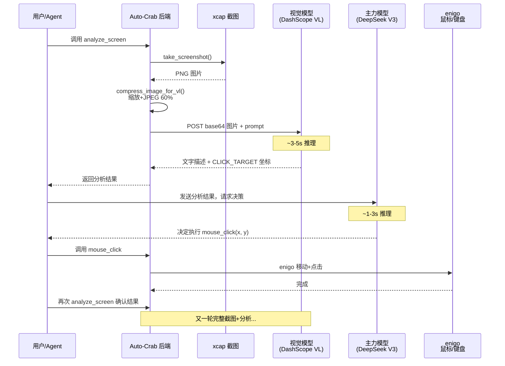
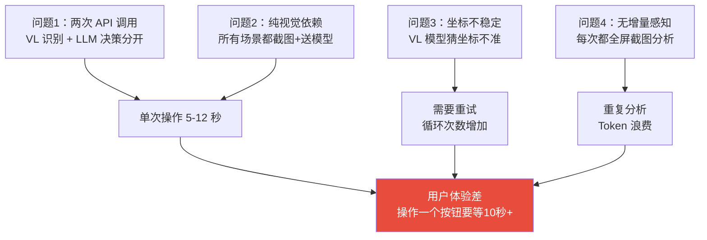
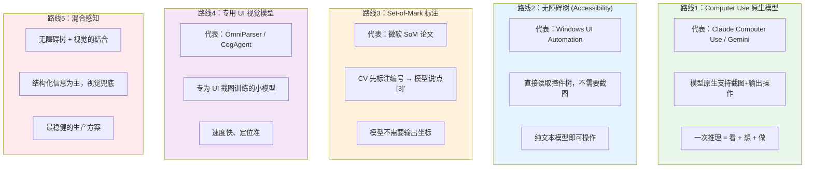
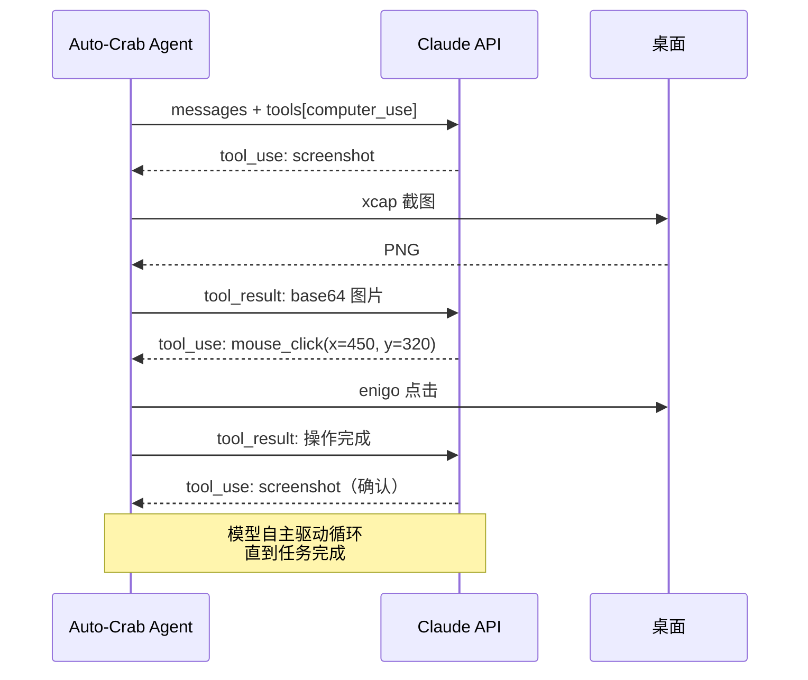
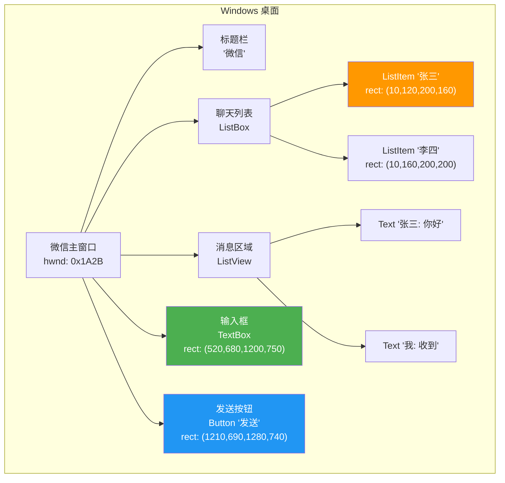
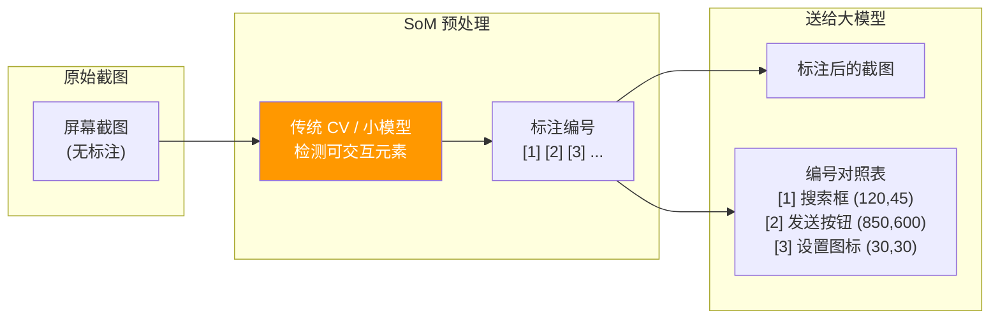
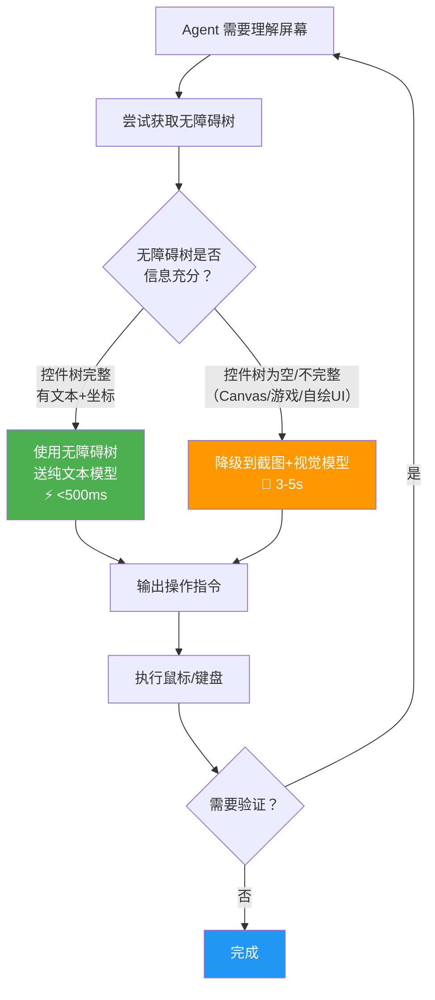
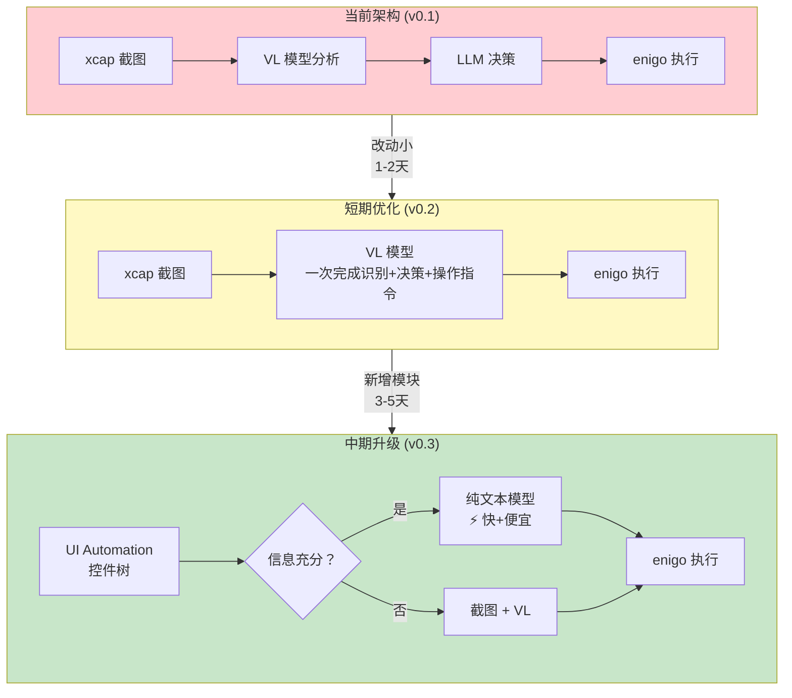
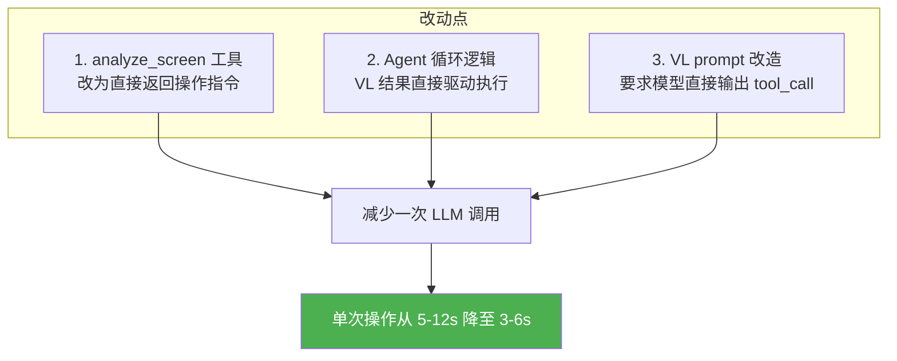
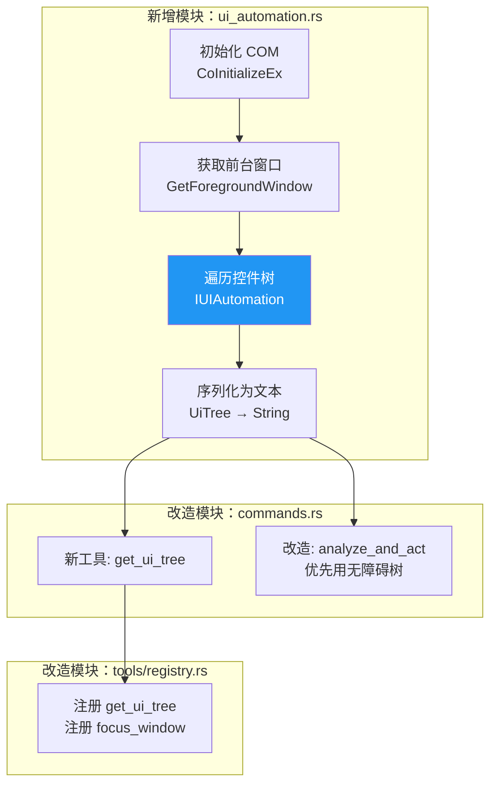

# Auto-Crab 桌面视觉自动化方案

> 目标：让 AI 助理高效地"看懂桌面、操作桌面"，替代当前低效的多轮截图流程。

---

## 1. 当前架构与瓶颈分析

### 1.1 现有工作流



### 1.2 瓶颈定量分析

| 步骤 | 耗时 | 占比 | 瓶颈原因 |
|------|------|------|----------|
| 截图 (xcap) | ~200ms | 2% | 快，不是瓶颈 |
| 图片压缩 | ~300ms | 3% | JPEG 编码 + 缩放 |
| Base64 编码 + 上传 | ~500-1500ms | 10% | 1280px 图约 100-180KB base64 |
| **VL 模型推理** | **3000-5000ms** | **45%** | 图片 token 多，远程 API 延迟 |
| **结果返回 → LLM 二次推理** | **1000-3000ms** | **25%** | 完全冗余的第二次 API 调用 |
| 鼠标/键盘执行 | ~300ms | 3% | 快，不是瓶颈 |
| **等待确认（再截图一轮）** | **4000-7000ms** | — | 整个循环重来 |

**总计单次"看+做"循环：5-12 秒**

### 1.3 核心问题



---

## 2. 业界技术路线全览

### 2.1 五种主要路线



### 2.2 详细对比

| 维度 | 路线1<br/>Computer Use | 路线2<br/>无障碍树 | 路线3<br/>SoM 标注 | 路线4<br/>专用 UI 模型 | 路线5<br/>混合感知 |
|------|----------------------|-------------------|-------------------|---------------------|-------------------|
| **核心思想** | 模型原生看屏操作 | 读 OS 控件树 | CV 标号+模型选号 | 小模型专攻 UI | 无障碍树+视觉兜底 |
| **需要视觉模型** | 是（内置） | **不需要** | 是 | 是（小型专用） | 部分场景需要 |
| **坐标精度** | 中等 | **精确**（OS 提供） | 高（CV 定位） | 高 | **精确** |
| **单次延迟** | 3-5s | **<500ms** | 1-2s | 1-2s | **<1s**（主路径） |
| **API 成本** | 高 | **零** | 中 | 低（本地可跑） | 低 |
| **覆盖范围** | 任意界面 | 标准 UI 控件 | 任意界面 | 任意界面 | 标准 UI + Canvas |
| **实现复杂度** | 低（调 API） | 中（OS API 对接） | 中（CV pipeline） | 高（部署模型） | 中高 |
| **对 Auto-Crab 适配** | 需新增 Provider | 需新增模块 | 需新增预处理 | 需部署推理服务 | 需新增模块+路由 |

### 2.3 各路线的技术原理

#### 路线 1：Computer Use 原生模型

以 Claude Computer Use 为例，模型训练时就包含了"看屏幕 → 输出操作"的能力。API 通信协议如下：



关键区别：**模型自己决定何时截图、看什么、做什么**，不需要外部编排两次 API 调用。

请求格式示例：

```json
{
  "model": "claude-sonnet-4-20250514",
  "max_tokens": 4096,
  "tools": [
    {
      "type": "computer_20250124",
      "name": "computer",
      "display_width_px": 2560,
      "display_height_px": 1440,
      "display_number": 1
    }
  ],
  "messages": [
    { "role": "user", "content": "打开微信，找到张三的聊天，发送'今晚开会'" }
  ]
}
```

模型返回的 tool_use 指令：

```json
{
  "type": "tool_use",
  "name": "computer",
  "input": {
    "action": "mouse_move",
    "coordinate": [450, 320]
  }
}
```

#### 路线 2：Windows UI Automation（无障碍树）

Windows 提供 UI Automation API，能获取任意窗口的控件树结构：



将控件树序列化为文本后，纯文本模型（DeepSeek V3）就能理解：

```
[Window] 微信
  [TitleBar] 微信
  [ListBox] 聊天列表
    [ListItem#1] 张三  rect=(10,120,200,160)
    [ListItem#2] 李四  rect=(10,160,200,200)
  [ListView] 消息区域
    [Text] 张三: 你好
    [Text] 我: 收到
  [TextBox] 输入框  rect=(520,680,1200,750)  editable=true
  [Button] 发送  rect=(1210,690,1280,740)  clickable=true
```

模型只需回复：`keyboard_type("今晚开会")` → `mouse_click(1245, 715)`。坐标是精确的，因为 OS 直接提供了 rect。

#### 路线 3：Set-of-Mark（SoM）



模型看到标注后的图片，只需说"点击 [2]"，不需要输出坐标。准确率显著高于让模型直接猜坐标。

#### 路线 4：专用 UI 视觉模型

| 模型 | 来源 | 大小 | 能力 | 是否开源 |
|------|------|------|------|----------|
| OmniParser v2 | 微软 | ~7B | UI 元素检测+OCR+图标识别 | 是 |
| CogAgent | 清华+智谱 | 18B | 屏幕理解+操作输出 | 是 |
| SeeClick | 北大 | 9.6B | GUI grounding（点哪里） | 是 |
| Qwen2.5-VL | 阿里 | 3B/7B/72B | 通用视觉+UI 理解 | 是 |
| UI-TARS | 字节 | 7B/72B | 原生 GUI Agent | 是 |

这些模型可以通过 Ollama 本地部署，推理延迟 ~0.5-2s，不需要远程 API。

#### 路线 5：混合感知（推荐最终形态）



---

## 3. Auto-Crab 推荐方案

### 3.1 整体架构演进



### 3.2 性能预期

| 指标 | 当前 (v0.1) | 短期 (v0.2) | 中期 (v0.3) |
|------|------------|------------|------------|
| 单次操作延迟 | 5-12s | 3-6s | **<1s**（无障碍树路径）<br/>3-6s（视觉兜底） |
| API 调用次数 | 2次/操作 | **1次/操作** | 0-1次/操作 |
| Token 消耗 | 高（图片token多） | 中 | **低**（纯文本为主） |
| 坐标准确率 | ~60-70% | ~70-80% | **~99%**（OS 提供坐标） |
| 适用范围 | 任意界面 | 任意界面 | 标准 UI ✅<br/>Canvas/自绘 ✅（降级） |

---

## 4. 短期优化方案（v0.2）

> 目标：把 2 次 API 调用合并为 1 次，消除冗余的二次推理。
> 预计工期：1-2 天。

### 4.1 改动概览



### 4.2 实施步骤

#### 步骤 1：改造 `analyze_screen` 工具的 prompt

**文件**：`src-tauri/src/commands.rs`，`analyze_screen` 分支（约第 399-419 行）

当前 prompt 要求模型"描述内容 + 输出 CLICK_TARGET 坐标"，但结果还要送给 LLM 二次处理。改为让 VL 模型直接输出结构化操作指令。

**改造前**的 prompt：

```
请详细描述截图中的内容...如果你看到需要点击的UI元素，请输出 CLICK_TARGET: (x, y) 元素名称
```

**改造后**的 prompt 模板：

```
你是桌面操作助理。分析截图并完成用户指定任务。

用户任务：{question}
屏幕分辨率：{screen_w}x{screen_h}

请输出 JSON 格式响应：
{
  "screen_description": "当前屏幕简要描述",
  "task_status": "need_action | completed | impossible",
  "actions": [
    {
      "type": "click | type | key_press | scroll",
      "x": 数字（click/scroll 时必填），
      "y": 数字（click/scroll 时必填），
      "text": "字符串（type 时必填）",
      "key": "字符串（key_press 时必填）",
      "reason": "为什么执行这个操作"
    }
  ]
}

如果任务已完成或不需要操作，actions 返回空数组。
只输出 JSON，不要输出其他内容。
```

#### 步骤 2：新增 `analyze_and_act` 工具

**文件**：`src-tauri/src/tools/registry.rs`

在 `register_builtins()` 中新增：

```rust
self.register(ToolSpec {
    name: "analyze_and_act".into(),
    description: "Take a screenshot, analyze it with AI vision, and execute the \
        required actions (click/type/key_press) in one step. This is the preferred \
        tool for desktop automation - it combines analyze_screen + mouse_click + \
        keyboard_type into a single call. Returns the result after executing actions."
        .into(),
    operation_type: "execute_shell".into(),
    parameters: vec![
        ToolParam {
            name: "task".into(),
            param_type: "string".into(),
            description: "The task to accomplish (e.g. 'click the Send button', \
                'type hello in the search box')".into(),
            required: true,
        },
        ToolParam {
            name: "max_steps".into(),
            param_type: "integer".into(),
            description: "Maximum action steps to execute (default: 3)".into(),
            required: false,
        },
    ],
});
```

#### 步骤 3：实现 `analyze_and_act` 执行逻辑

**文件**：`src-tauri/src/commands.rs`，在 `execute_tool_call` 的 match 中新增分支。

伪代码逻辑：

```
fn analyze_and_act(task, max_steps=3):
    for step in 0..max_steps:
        screenshot = take_screenshot()
        compressed = compress_image_for_vl(screenshot)
        
        response = call_vl_model(compressed, task_prompt)
        actions = parse_json(response)
        
        if actions.task_status == "completed" or actions.is_empty():
            return "任务完成: " + actions.screen_description
        
        for action in actions:
            match action.type:
                "click"     => do_mouse_click(action.x, action.y, "left")
                "type"      => do_keyboard_type(action.text)
                "key_press" => do_key_press(action.key)
            sleep(500ms)  // 等待 UI 响应
    
    return "已执行 {max_steps} 步，请检查结果"
```

#### 步骤 4：保留旧工具兼容

不删除 `analyze_screen`、`mouse_click`、`keyboard_type` 等原有工具，保持向后兼容。`analyze_and_act` 作为新增的高效替代。

### 4.3 验证清单

- [ ] `analyze_and_act` 能一步完成"点击桌面某个图标"
- [ ] VL 模型返回的 JSON 能正确解析
- [ ] JSON 解析失败时有 fallback（退回原有流程）
- [ ] `max_steps` 参数正常限制循环次数
- [ ] 旧的 `analyze_screen` + `mouse_click` 流程不受影响

---

## 5. 中期升级方案（v0.3）— UI Automation 集成

> 目标：引入 Windows 无障碍树，大部分场景不再需要截图和视觉模型。
> 预计工期：3-5 天。

### 5.1 架构设计



### 5.2 实施步骤

#### 步骤 1：添加 Windows UI Automation 依赖

**文件**：`src-tauri/Cargo.toml`

```toml
[target.'cfg(windows)'.dependencies]
windows = { version = "0.58", features = [
    "Win32_UI_Accessibility",
    "Win32_Foundation",
    "Win32_UI_WindowsAndMessaging",
    "Win32_System_Com",
] }
```

#### 步骤 2：新建 `src-tauri/src/tools/ui_automation.rs`

核心数据结构：

```rust
use serde::{Deserialize, Serialize};

#[derive(Debug, Clone, Serialize, Deserialize)]
pub struct UiNode {
    pub role: String,         // Button, TextBox, ListItem, ...
    pub name: String,         // 控件文本/标签
    pub value: String,        // 输入框的当前值
    pub rect: UiRect,         // 屏幕坐标 bounding box
    pub states: Vec<String>,  // focusable, clickable, editable, ...
    pub children: Vec<UiNode>,
}

#[derive(Debug, Clone, Serialize, Deserialize)]
pub struct UiRect {
    pub x: i32,
    pub y: i32,
    pub width: i32,
    pub height: i32,
}

#[derive(Debug, Clone, Serialize, Deserialize)]
pub struct UiTreeSnapshot {
    pub window_title: String,
    pub window_rect: UiRect,
    pub tree: Vec<UiNode>,
    pub timestamp: String,
}
```

核心函数签名：

```rust
/// 获取前台窗口的 UI 控件树
pub fn get_foreground_ui_tree(max_depth: u32) -> anyhow::Result<UiTreeSnapshot>

/// 将 UI 控件树序列化为 LLM 可读的文本格式
pub fn serialize_ui_tree(snapshot: &UiTreeSnapshot) -> String

/// 在控件树中查找匹配的元素，返回其中心坐标
pub fn find_element_center(snapshot: &UiTreeSnapshot, name: &str) -> Option<(i32, i32)>

/// 获取指定窗口标题的 UI 控件树
pub fn get_window_ui_tree(window_title: &str, max_depth: u32) -> anyhow::Result<UiTreeSnapshot>
```

实现要点：

```rust
// 使用 Windows UI Automation API
use windows::Win32::UI::Accessibility::*;
use windows::Win32::UI::WindowsAndMessaging::*;
use windows::Win32::System::Com::*;

pub fn get_foreground_ui_tree(max_depth: u32) -> anyhow::Result<UiTreeSnapshot> {
    unsafe {
        // 1. 初始化 COM
        CoInitializeEx(None, COINIT_MULTITHREADED)?;
        
        // 2. 创建 UIAutomation 实例
        let uia: IUIAutomation = CoCreateInstance(
            &CUIAutomation,
            None,
            CLSCTX_INPROC_SERVER,
        )?;
        
        // 3. 获取前台窗口
        let hwnd = GetForegroundWindow();
        let element = uia.ElementFromHandle(hwnd)?;
        
        // 4. 递归遍历子元素
        let tree = walk_element(&uia, &element, 0, max_depth)?;
        
        // 5. 构建快照
        Ok(UiTreeSnapshot {
            window_title: element.CurrentName()?.to_string(),
            window_rect: get_element_rect(&element)?,
            tree,
            timestamp: chrono::Utc::now().to_rfc3339(),
        })
    }
}
```

序列化输出示例：

```
[Window] 微信 (0,0 1920x1080)
├─ [TitleBar] 微信
├─ [List] 聊天列表
│  ├─ [ListItem] 张三 (10,120 190x40) {clickable}
│  ├─ [ListItem] 李四 (10,160 190x40) {clickable}
│  └─ [ListItem] 工作群 (10,200 190x40) {clickable}
├─ [List] 消息区域
│  ├─ [Text] 张三: 明天开会吗
│  ├─ [Text] 你: 几点？
│  └─ [Text] 张三: 下午3点
├─ [Edit] 输入框 (520,680 680x70) {editable, focused}
└─ [Button] 发送 (1210,690 70x50) {clickable}
```

#### 步骤 3：注册新工具

**文件**：`src-tauri/src/tools/registry.rs`

```rust
self.register(ToolSpec {
    name: "get_ui_tree".into(),
    description: "Get the UI element tree of the foreground window. Returns a \
        structured text representation of all UI controls with their types, names, \
        coordinates, and states. Use this INSTEAD of analyze_screen when you need \
        to understand the current window's UI structure - it's 10x faster and \
        gives exact coordinates. Falls back to analyze_screen for Canvas/custom-drawn UIs."
        .into(),
    operation_type: "read_file".into(),
    parameters: vec![
        ToolParam {
            name: "window_title".into(),
            param_type: "string".into(),
            description: "Optional: specific window title to inspect (default: foreground window)"
                .into(),
            required: false,
        },
        ToolParam {
            name: "max_depth".into(),
            param_type: "integer".into(),
            description: "Max tree depth to traverse (default: 8, reduce for large windows)"
                .into(),
            required: false,
        },
    ],
});

self.register(ToolSpec {
    name: "focus_window".into(),
    description: "Bring a window to the foreground by its title (partial match)."
        .into(),
    operation_type: "execute_shell".into(),
    parameters: vec![ToolParam {
        name: "title".into(),
        param_type: "string".into(),
        description: "Window title to search for (partial match, e.g. '微信')".into(),
        required: true,
    }],
});
```

#### 步骤 4：改造 `analyze_and_act` 增加智能路由

**文件**：`src-tauri/src/commands.rs`

```
fn analyze_and_act(task, max_steps):
    // 第一步：尝试无障碍树
    ui_tree = try get_foreground_ui_tree(max_depth=8)
    
    if ui_tree.has_useful_elements():
        // 快速路径：纯文本模型 + 无障碍树
        prompt = format_ui_tree_prompt(ui_tree, task)
        response = call_text_model(prompt)  // DeepSeek V3，快且便宜
        actions = parse_actions(response)
        execute(actions)
    else:
        // 降级路径：截图 + 视觉模型
        // 走原有 v0.2 的 analyze_and_act 逻辑
        screenshot_and_vl_act(task, max_steps)
```

判断"无障碍树是否有用"的启发式规则：

```rust
fn has_useful_elements(snapshot: &UiTreeSnapshot) -> bool {
    let total_nodes = count_nodes(&snapshot.tree);
    let clickable = count_by_state(&snapshot.tree, "clickable");
    let with_text = count_with_name(&snapshot.tree);
    
    // 至少有 3 个控件节点，且半数以上有文本
    total_nodes >= 3 && with_text as f64 / total_nodes as f64 > 0.3
}
```

#### 步骤 5：处理常见边界情况

| 场景 | 无障碍树表现 | 处理策略 |
|------|-------------|----------|
| 微信、飞书、钉钉 | 控件树较完整 | 无障碍树路径 ✅ |
| Chrome/Edge 网页 | 浏览器控件+内部 DOM 有限 | 无障碍树路径（网页内容可通过 CDP 获取） |
| K 线图/Canvas | 控件树只有一个 Canvas 元素 | 降级到截图+VL ✅ |
| 游戏/DirectX | 无控件树 | 降级到截图+VL ✅ |
| 系统对话框 | 完整控件树 | 无障碍树路径 ✅ |
| 远程桌面窗口 | 只有外层框架 | 降级到截图+VL ✅ |

### 5.3 新增文件清单

| 文件 | 类型 | 说明 |
|------|------|------|
| `src-tauri/src/tools/ui_automation.rs` | 新建 | UI Automation 核心模块 |
| `src-tauri/src/tools/mod.rs` | 修改 | 添加 `pub mod ui_automation;` |
| `src-tauri/src/tools/registry.rs` | 修改 | 注册 `get_ui_tree` 和 `focus_window` |
| `src-tauri/src/commands.rs` | 修改 | 添加 `get_ui_tree` 和 `focus_window` 执行逻辑，改造 `analyze_and_act` |
| `src-tauri/Cargo.toml` | 修改 | 添加 `windows` crate 依赖 |

### 5.4 验证清单

- [ ] `get_ui_tree` 能正确获取微信/飞书窗口的控件树
- [ ] 控件树序列化文本送 DeepSeek V3 能正确理解
- [ ] `focus_window` 能通过标题模糊匹配并切换窗口
- [ ] 智能路由在有控件树时走文本模型，Canvas 场景降级到视觉模型
- [ ] 性能：无障碍树路径端到端 < 1 秒
- [ ] 跨 DPI 场景坐标正确（高分屏 150%/200% 缩放）
- [ ] 超大控件树（如 Excel 表格上千单元格）不会导致 OOM 或超时

---

## 6. 后续演进方向（v0.4+）

以下为中长期可选方向，视需求优先级安排：

### 6.1 Computer Use 协议对接

当 Claude / Gemini 的 Computer Use API 稳定可用后，新增一个 `computer_use` Provider，让模型原生驱动截图-操作循环。

**前置条件**：代理网络稳定访问 Anthropic API（参见 `cursor-region-proxy-guide.md`）。

### 6.2 本地 UI 专用模型

通过 Ollama 部署 OmniParser / UI-TARS 等专为 UI 截图训练的小模型，替代远程 VL API 调用：

```toml
[models.ui_vision]
provider = "ollama"
model = "ui-tars:7b"
endpoint = "http://localhost:11434"
```

好处：零 API 成本、低延迟（~1s）、离线可用。

### 6.3 增量感知

不再每次全屏截图，而是只检测屏幕变化区域：

```rust
fn incremental_screenshot(prev: &Image, curr: &Image) -> Vec<ChangedRegion> {
    // 对比两帧差异，只对变化区域做 VL 分析
}
```

### 6.4 操作录制与回放

记录用户的操作序列，生成可重复执行的自动化脚本，不需要每次都调用模型：

```json
{
  "name": "发微信消息给张三",
  "steps": [
    { "action": "focus_window", "title": "微信" },
    { "action": "click_element", "name": "张三", "role": "ListItem" },
    { "action": "type", "target": "输入框", "text": "{message}" },
    { "action": "click_element", "name": "发送", "role": "Button" }
  ]
}
```

---

## 7. 技术参考

| 资源 | 链接 |
|------|------|
| Claude Computer Use 文档 | https://docs.anthropic.com/en/docs/agents-and-tools/computer-use |
| Windows UI Automation (Rust) | https://docs.rs/windows/latest/windows/Win32/UI/Accessibility |
| OmniParser (微软) | https://github.com/microsoft/OmniParser |
| UI-TARS (字节) | https://github.com/bytedance/UI-TARS |
| Set-of-Mark 论文 | https://arxiv.org/abs/2310.11441 |
| CogAgent (智谱) | https://github.com/THUDM/CogAgent |
| enigo (当前使用) | https://docs.rs/enigo |
| xcap (当前使用) | https://docs.rs/xcap |
| windows crate | https://docs.rs/windows |
