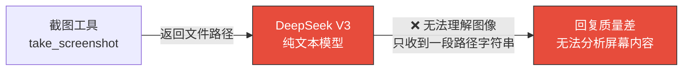
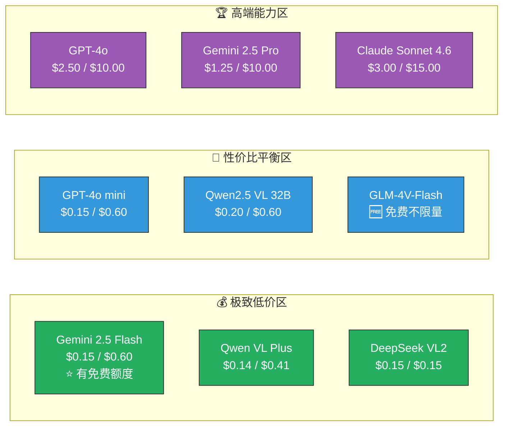
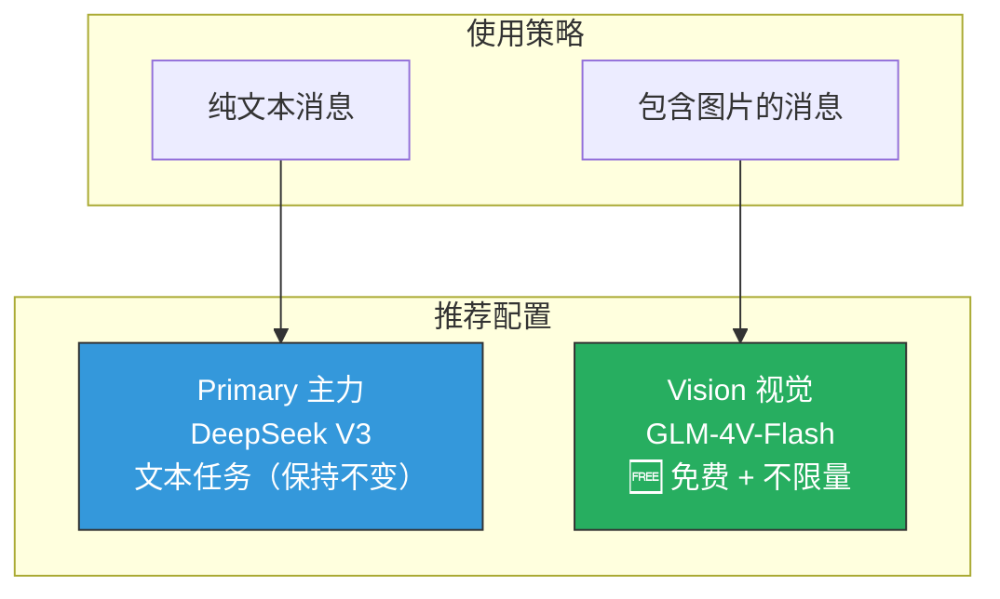
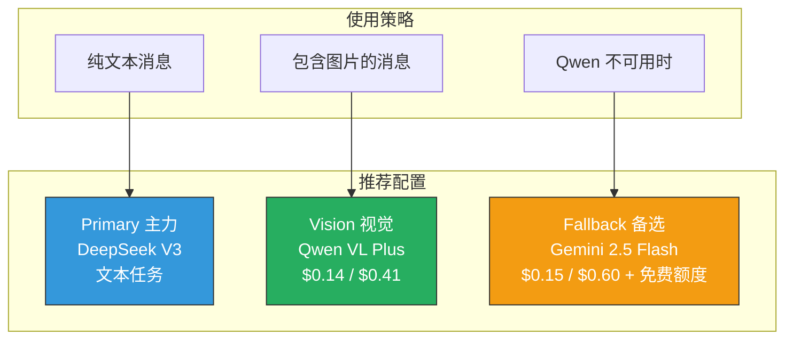
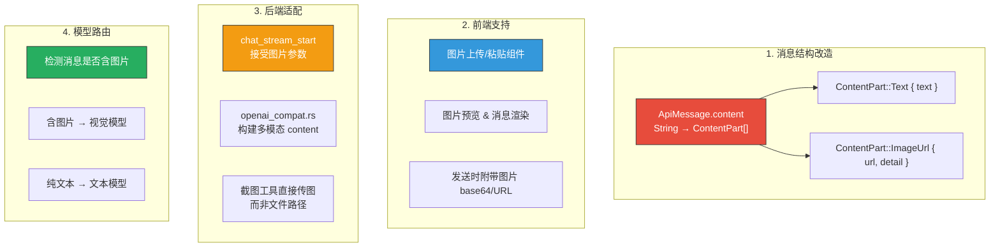
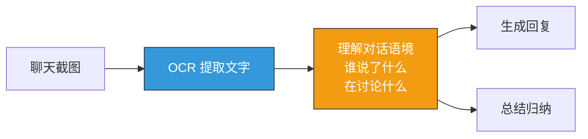
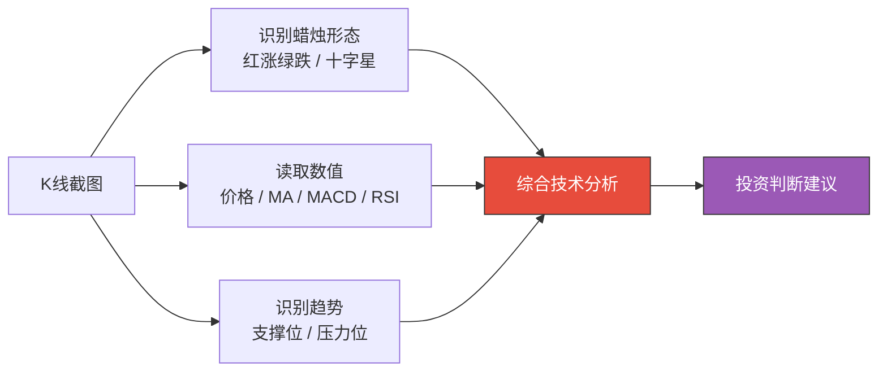
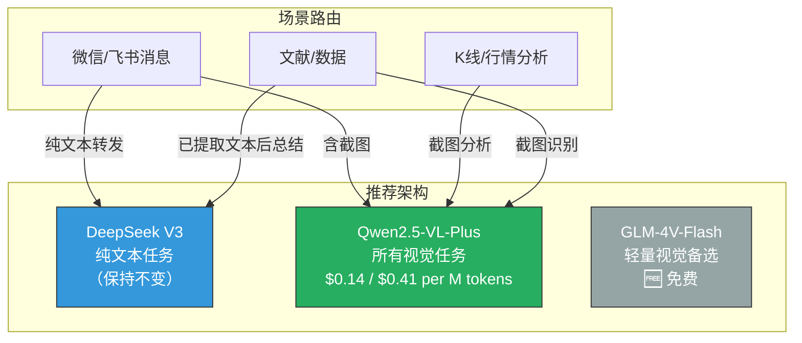

# Auto-Crab 视觉模型选型调研

## 当前问题

Auto-Crab 目前使用 DeepSeek V3 作为主力模型，但 **DeepSeek V3 是纯文本模型，不支持图像输入**。项目中虽然有截图工具（`screenshot`），但截图后只是把文件路径作为文本发给模型，模型无法真正"看到"图片内容。



**目标：** 找到支持视觉（Vision）能力、回复质量高、且 Token 资费低的模型。

---

## 当前项目架构约束

分析项目代码后，需要关注以下约束条件：

| 约束 | 说明 |
|------|------|
| API 格式 | 统一使用 OpenAI Chat Completions 兼容格式（`/v1/chat/completions`） |
| 已支持的 Provider | `openai`、`deepseek`、`dashscope`（通义/Qwen）、`zhipu`（智谱）、`moonshot`、`anthropic`、`ollama` |
| 消息结构 | 当前 `content` 为纯文本字符串，需改造为数组格式以支持图文混合 |
| 模型切换 | 前端有 Provider 选择器，但未与后端打通，当前始终使用 `primary` 模型 |

> **关键：新模型最好已在项目支持的 Provider 列表中，减少适配工作量。**

---

## 候选模型对比

### 一、性价比排行（按输入价格升序）



### 二、详细对比表

| 模型 | 提供商 | 输入价格<br/>($/M tokens) | 输出价格<br/>($/M tokens) | 视觉能力 | 上下文窗口 | 项目已支持 | 推荐度 |
|------|--------|--------------------------|--------------------------|---------|-----------|-----------|--------|
| **GLM-4V-Flash** | 智谱 | 🆓 免费 | 🆓 免费 | ✅ 图像 | 8K | ✅ `zhipu` | ⭐⭐⭐⭐⭐ |
| **Gemini 2.5 Flash** | Google | $0.15 | $0.60 | ✅ 图像/视频 | 1M | ❌ 需新增 | ⭐⭐⭐⭐⭐ |
| **Qwen VL Plus** | 阿里 | $0.14 | $0.41 | ✅ 图像 | 131K | ✅ `dashscope` | ⭐⭐⭐⭐ |
| **DeepSeek VL2** | DeepSeek | $0.15 | $0.15 | ✅ 图像 | 4K | ✅ `deepseek` | ⭐⭐⭐ |
| **GPT-4o mini** | OpenAI | $0.15 | $0.60 | ✅ 图像 | 128K | ✅ `openai` | ⭐⭐⭐⭐ |
| **Qwen2.5 VL 32B** | 阿里 | $0.20 | $0.60 | ✅ 图像 | 128K | ✅ `dashscope` | ⭐⭐⭐⭐ |
| **GPT-4o** | OpenAI | $2.50 | $10.00 | ✅ 图像/音频 | 128K | ✅ `openai` | ⭐⭐⭐ |
| **Gemini 2.5 Pro** | Google | $1.25 | $10.00 | ✅ 图像/视频 | 1M | ❌ 需新增 | ⭐⭐⭐ |
| **Claude Sonnet 4.6** | Anthropic | $3.00 | $15.00 | ✅ 图像 | 200K | ✅ `anthropic` | ⭐⭐ |

> 价格为每百万 Token 美元价格，数据截至 2026 年 3 月。

---

## 推荐方案

### 方案一：零成本起步（推荐立即尝试）



| 项目 | 说明 |
|------|------|
| 文本模型 | DeepSeek V3（保持不变） |
| 视觉模型 | GLM-4V-Flash（智谱，**完全免费**） |
| 额外成本 | **¥0** |
| 适配工作 | 最小 — 项目已支持 `zhipu` Provider |
| 局限性 | GLM-4V-Flash 视觉能力中等，复杂图表分析可能不够精准 |

### 方案二：高性价比组合（推荐预算有限时）



| 项目 | 说明 |
|------|------|
| 文本模型 | DeepSeek V3 |
| 视觉模型 | Qwen VL Plus（通义千问，通过 DashScope 调用） |
| 备选模型 | Gemini 2.5 Flash（有免费额度，1M 超长上下文） |
| 月估算成本 | 约 $1-5（日均 100 次视觉调用） |
| 适配工作 | 中等 — Qwen 已支持，Gemini 需新增 Provider |

### 方案三：最佳质量体验

| 项目 | 说明 |
|------|------|
| 文本模型 | DeepSeek V3 / GPT-4o |
| 视觉模型 | GPT-4o（视觉理解最强之一） |
| 月估算成本 | 约 $10-50 |
| 适用场景 | 对视觉分析精度要求极高的专业场景 |

---

## 费用估算

以日均 **100 次对话、每次约 3000 输入 + 1500 输出 Token** 为基准：

| 模型 | 单次成本 | 日成本 | 月成本（30天） |
|------|---------|--------|---------------|
| GLM-4V-Flash | 免费 | 免费 | **¥0** |
| Qwen VL Plus | $0.001 | $0.10 | **$3.0 (≈¥22)** |
| Gemini 2.5 Flash | $0.001 | $0.10 | **$3.0 (≈¥22)** |
| DeepSeek VL2 | $0.0007 | $0.07 | **$2.1 (≈¥15)** |
| GPT-4o mini | $0.001 | $0.10 | **$3.0 (≈¥22)** |
| GPT-4o | $0.023 | $2.25 | **$67.5 (≈¥490)** |
| Claude Sonnet 4.6 | $0.032 | $3.15 | **$94.5 (≈¥686)** |

> 视觉请求中图片 Token 通常额外占用 500-2000 Token，实际费用会略高于上述估算。

---

## 需要的代码改造

要让 Auto-Crab 支持视觉模型，需要改造以下模块：



### OpenAI Vision API 消息格式参考

```json
{
  "model": "gpt-4o",
  "messages": [
    {
      "role": "user",
      "content": [
        { "type": "text", "text": "这张截图里显示了什么？" },
        {
          "type": "image_url",
          "image_url": {
            "url": "data:image/png;base64,iVBORw0KGgo...",
            "detail": "auto"
          }
        }
      ]
    }
  ]
}
```

> 以上格式被 OpenAI、Qwen VL、Gemini、GLM-4V 等均兼容（OpenAI 兼容格式），与项目当前的 API 适配架构一致。

---

## 实际场景需求分析

Auto-Crab 的核心使用场景有三个，每个场景对视觉模型的要求不同：

### 场景拆解

```mermaid
graph TB
    subgraph "场景一：消息应用（微信/飞书）"
        S1A["截取聊天窗口"]
        S1B["OCR 识别聊天文字"]
        S1C["理解上下文语义"]
        S1D["生成回复 / 总结归纳"]
        S1A --> S1B --> S1C --> S1D
    end

    subgraph "场景二：交易网站（K线/行情）"
        S2A["截取行情页面"]
        S2B["识别 K 线形态"]
        S2C["读取价格/指标数值"]
        S2D["综合分析 + 投资判断"]
        S2A --> S2B --> S2C --> S2D
    end

    subgraph "场景三：文献/数据网站"
        S3A["截取网页内容"]
        S3B["识别文字/表格/图表"]
        S3C["提取关键信息"]
        S3D["归纳总结输出"]
        S3A --> S3B --> S3C --> S3D
    end

    style S1D fill:#3498DB,stroke:#333,color:#fff
    style S2D fill:#E74C3C,stroke:#333,color:#fff
    style S3D fill:#27AE60,stroke:#333,color:#fff
```



### 各场景能力需求矩阵

| 能力需求 | 场景一：消息应用 | 场景二：K线行情 | 场景三：文献数据 |
|---------|:---------------:|:--------------:|:--------------:|
| **中文 OCR** | ⭐⭐⭐⭐⭐ 核心 | ⭐⭐⭐ 需要 | ⭐⭐⭐⭐⭐ 核心 |
| **图表理解** | ⭐ 很少 | ⭐⭐⭐⭐⭐ 核心 | ⭐⭐⭐⭐ 重要 |
| **数值精度** | ⭐⭐ 一般 | ⭐⭐⭐⭐⭐ 核心 | ⭐⭐⭐⭐ 重要 |
| **语义推理** | ⭐⭐⭐⭐ 重要 | ⭐⭐⭐⭐⭐ 核心 | ⭐⭐⭐⭐ 重要 |
| **长文本总结** | ⭐⭐⭐⭐ 重要 | ⭐⭐ 一般 | ⭐⭐⭐⭐⭐ 核心 |
| **UI 元素定位** | ⭐ 不需要 | ⭐ 不需要 | ⭐ 不需要 |
| **难度评级** | 中等 | **最高** | 中等 |

> **关键发现：** 三个场景都不需要 UI 元素坐标定位（Computer Use），核心需求是 **"看懂内容 + 深度理解 + 推理分析"**，其中 K 线场景难度最高。

---

## 针对场景的模型能力评估

### 场景一：微信/飞书消息识别

**需求本质：** 中文聊天截图 OCR + 上下文理解 + 回复/总结生成



| 模型 | 中文 OCR | 对话理解 | 总结能力 | 综合评分 |
|------|---------|---------|---------|---------|
| Qwen2.5-VL Plus | ⭐⭐⭐⭐⭐ | ⭐⭐⭐⭐⭐ | ⭐⭐⭐⭐⭐ | **最佳** |
| GLM-4V-Flash | ⭐⭐⭐⭐ | ⭐⭐⭐ | ⭐⭐⭐ | 够用 |
| GPT-4o mini | ⭐⭐⭐ | ⭐⭐⭐⭐ | ⭐⭐⭐⭐ | 良好 |

> Qwen 系列对中文理解天然优势明显，微信/飞书场景首选。GPT-4o mini 中文 OCR 偶有漏字。

### 场景二：交易网站 / K 线分析

**需求本质：** 蜡烛图形态识别 + 价格/指标数值读取 + 技术分析推理

这是三个场景中**难度最高**的，因为模型需要同时具备：

1. **视觉识别** — 看懂红绿蜡烛、均线走势、成交量柱状图
2. **数值精度** — 准确读出价格（如 BTC $67,432.15）、涨跌幅、技术指标
3. **金融推理** — 识别旗形、双底、头肩顶等技术形态，给出分析判断



| 模型 | K线识别 | 数值精度 | 技术分析推理 | 综合评分 |
|------|--------|---------|------------|---------|
| Qwen2.5-VL Plus | ⭐⭐⭐⭐ | ⭐⭐⭐⭐ | ⭐⭐⭐⭐ | **最佳性价比** |
| Qwen3-VL-30B | ⭐⭐⭐⭐⭐ | ⭐⭐⭐⭐⭐ | ⭐⭐⭐⭐⭐ | 最强（已有实测） |
| GPT-4o | ⭐⭐⭐⭐ | ⭐⭐⭐⭐⭐ | ⭐⭐⭐⭐⭐ | 最强（但贵） |
| GLM-4V-Flash | ⭐⭐ | ⭐⭐ | ⭐⭐ | **不推荐** |
| GPT-4o mini | ⭐⭐⭐ | ⭐⭐⭐ | ⭐⭐⭐ | 勉强 |

> **实测数据：** Qwen3-VL 在加密货币 K 线分析中已验证可用，能识别旗形、双底等形态，支持 MA/MACD/RSI 分析，可输出结构化情绪评分。
>
> **截图建议：** 分辨率 ≥ 600×400、PNG 格式优于 JPEG、保留完整的时间轴和价格轴。

### 场景三：文献/数据网站

**需求本质：** 网页截图 OCR + 表格/图表理解 + 信息归纳总结

| 模型 | 文字 OCR | 表格识别 | 图表理解 | 总结能力 | 综合评分 |
|------|---------|---------|---------|---------|---------|
| Qwen2.5-VL Plus | ⭐⭐⭐⭐⭐ | ⭐⭐⭐⭐⭐ | ⭐⭐⭐⭐ | ⭐⭐⭐⭐⭐ | **最佳** |
| GPT-4o mini | ⭐⭐⭐⭐ | ⭐⭐⭐⭐ | ⭐⭐⭐⭐ | ⭐⭐⭐⭐ | 良好 |
| GLM-4V-Flash | ⭐⭐⭐⭐ | ⭐⭐⭐⭐ | ⭐⭐⭐ | ⭐⭐⭐ | 够用 |

> Qwen2.5-VL 文档解析能力超越 GPT-4o（官方 benchmark），尤其在中文表格和多语言混合场景下优势明显。

---

## 最终推荐方案

综合三个场景，**Qwen2.5-VL 系列是全场景最优选择**：



### 为什么是 Qwen2.5-VL-Plus？

| 优势 | 说明 |
|------|------|
| **中文最强** | 中文 OCR 和语义理解是所有候选模型中最好的 |
| **图表分析验证过** | 已有实测数据证明能分析 K 线形态和技术指标 |
| **价格极低** | 输入 $0.14/M、输出 $0.41/M，日均百次调用月费仅约 ¥22 |
| **项目零适配** | `dashscope` Provider 已在项目中支持 |
| **上下文够长** | 131K tokens，长文献、长聊天记录一次读完 |

### 使用建议

| 场景 | 提示词策略 |
|------|-----------|
| 微信/飞书 | 用结构化提示：`"请识别截图中的聊天记录，按时间顺序列出每条消息的发送者和内容，然后总结讨论要点"` |
| K线分析 | 用思维链提示：`"请逐步分析：1.当前K线形态 2.关键价位 3.技术指标读数 4.趋势判断 5.操作建议"` |
| 文献数据 | 先截图识别内容，再用文本模型做深度总结（两步走，节省视觉模型 Token） |

### 月度成本预估

| 场景 | 日均调用 | 月成本 |
|------|---------|--------|
| 微信/飞书消息（截图理解） | ~30 次 | ≈ ¥7 |
| K线/行情（截图分析） | ~50 次 | ≈ ¥11 |
| 文献/数据（截图识别） | ~20 次 | ≈ ¥4 |
| **合计** | **~100 次/天** | **≈ ¥22/月** |

> 如果 K 线场景需要更精准的分析，可单独对该场景升级到 GPT-4o（增加约 ¥200/月），其他场景继续用 Qwen 控制成本。
